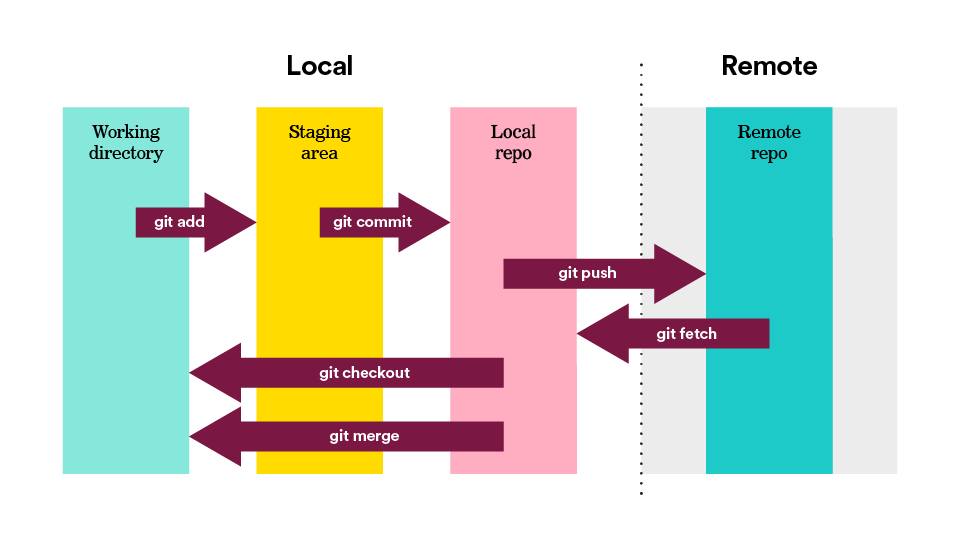

#  Git and GitHub Foundations (90 min)

| Timing | Type | Topic |
| --- | --- | --- |
| 5 min | [Opening](#opening) | Why Version Control? |
| 10 min | [Introduction](#introduction) | Version Control |
| 25 min | [Demo](#demo) | Git Configuration and Skills |
| 10 min | [Independent Practice](#ind-practice) | Topic |
| 25 min | [Demo](#demo) |Git Skills, Continued |
| 15 min | [Conclusion](#conclusion) | Review of Key Terms |

### LEARNING OBJECTIVES
**After this lesson, you will be able to:**  

- Understand basic Git commands like init, add, commit, push, pull, and clone.  
- Distinguish between local and remote repositories.
- Create, copy, merge, and delete local and remote repositories and branches using Git commands. 
- Describe how branching and merging allow for collaboration during development.   
- Fetch changes from a remote repository without merging them into your own.
- Fork and clone remote repositories.  
- Differentiate between navigating the file system using the command line vs. the GUI. 

---
<a name="opening"></a>
## Opening (5 min)

Students should split into pairs or small groups and spend a few minutes discussing the following questions: 

Assuming that version control systems did not exist, how would you:

* Share your source code with other developers?
* Collaborate with other developers?
* Manage multiple versions of a software product?
    - Free vs. paid
    - Basic vs. premium
    - 2.x vs. 3.x

> Instructor Note: Follow the activity with a brief recap of student discussions.

***

<a name="introduction"></a>
## Intro to New Material: Version Control (10 min)

### What is Version Control?

* Version control is the management of changes to documents, computer programs, websites, and other collections of information.
* Version control provides:
    - A database containing the history of changes to a set of files.
    - A set of commands for managing that database.

### Why is Version Control Helpful?

* It manage changes over time.
    - Save various points in the development of your work.  
    - See the history of your work.  
    - Travel "back in time" to see previous versions of your work.  
    - Manage multiple versions of a software project.  
* It aids sharing and collaboration.  
    - Share your work with others.
    - Work effectively as a team on a single project.
    - Allow others to modify your work in a controlled way.
    - Make multiple changes to a project in parallel with other team members.
    - Merge parallel changes in a controlled way.  
* It allows for experimentation.
    - Experiment with various ideas, and either keep or discard your tests.  
    - Keep multiple changes isolated until they are ready to be integrated.  

***

<a name="demo"></a>
## Demo: Git Configuration and Skills (25 min)

As a class, we are going to walk through key Git skills that you will need to be successful in this course. Some of the goals of this session include:  

* Checking our Git configuration.

* Developing our Git skills.
You will:
    - Create a local Git repository.
    - Add files.  
    - Make commits.  
    - Check the repo status.  
    - View history.  
    - Time travel.  

### Part 1: Set Up

Check the Git version:  
```
$ which git
$ git --version
```

If you don't have Git installed via brew, you should do so now.
```
brew install git            # use brew to install latest version of Git    
which git                   # should return "/usr/local/bin/git"
```

Check your Git config:
```
$ git config --list
$ git config user.name
```

Set your identity:
```
$ git config --global user.name "John Doe"    
$ git config --global user.email johndoe@example.com
```

Set your default editor:
```
$ git config --global core.editor "subl -n -w"
```

### Part 2: Creating a Repo
Create a new local Git repository:

```
$ cd ~/ga/wdi/exercises/learning-git
$ mkdir sample1  
$ cd sample1  
$ git init
```

* What just happened?
* Did your shell prompt change?

### Part 3: Our First Commit

Add some files:

```
$ touch README.md hello.txt  
$ git status                  # What is an untracked file?
$ git add -A                  # Now the files are in the stage
$ git status
```

Commit the changes:

```
$ git commit -m "Added 2 files."
$ git status
$ git log
```

> Instructor Note: On the whiteboard, draw a diagram of the following:
> 
- Working area  
- Stage  
- Git repository (.git)  



<br>


### Part 4: More Commits, and Viewing the Repo History

Edit `hello.txt`, and commit the following changes:

Modify a file:
```
$ echo "Hello, World" >> hello.txt
$ git status
```

We now see a "modified" file, but nothing is staged.
Let's add our changes to the stage:

```
$ git add .
$ git status
```

Now our changes are staged and we can do a commit:

```
$ git commit -m "Fixed hello.txt"
```

Let's view the repo history:

```
  $ git log
```

* Notice all of the info in the log.
* In what order are the commits displayed?

***

<a name="ind-practice"></a>
## Independent Practice: Changes and Commits (10 min)
Make some very simple changes to your file and commit them. Be sure to check your status and history as you go.

* Suggested changes:
    - Hello, General Assembly
    - Hello, WDI
    - Hello, Git

> Instructor Note: Leave a couple minutes to demo the solution.


<a name="demo"></a>
## Demo: Git Skills, Continued (25 mins)

### Part 5: Cherry Picking
> Instructor Note: Demonstrate how to edit multiple files, but only add one of them to the stage.

```
git add file1   
git commit  
git status  
git log
```

### Part 6: Checking Out a Previous Version

To see the old version:

```
git log  
git checkout <hash_of_previous_commit>
cat hello.txt  
```

To look at the history:

```
git log  
```
* Note: By default, the `log` command only shows up to our current commit.

To see all of the commits:

```
git log --all --decorate
```
* Note: What is `HEAD` and `master`?  

To return to the most recent version (two options):

```
git checkout master  

# or

git checkout <hash_of_most_recent_commit>  
```

### Part 7: Diffing
View unstaged differences:

```
git diff  

# or  

git diff filename  
```

View staged differences:  

```
git diff --staged

# or  

git diff --staged filename
```

### Part 8: Rolling Back Changes
Un-stage changes to a file:  
```
git reset filename  
git status  
```

Discard changes (reverting to the committed version):
```
git checkout filename  
git status
```  
***

<a name="conclusion"></a>
## Conclusion (15 min)
* Review Git terminology:
    - **Repository**: A collection of related commits that form a directed acyclic graph.
    - **Commit**: A snapshot of the working tree at a given time (along with a message detailing what changed).
    - **The index (stage)**: A staging area where we list changes we want to commit.
    - **Branch**: A set of commits that form a linear progression of changes.
    - **Master**: The default name for the "main" development branch.
    - **Tag**: An optional label on a commit.
    - **HEAD**: The commit that is currently checked out.
    - **Working area**: The directory and subdirectories containing the files we're currently editing.
* Review questions:  
    - Can someone tell me what a Git repository is?
    - What are some key components of a Git repo?
    - Can someone describe an important Git command? (Get several responses from students).

***

### Hungry for More?
#### References
- [Git Cheat Sheet](https://raw.githubusercontent.com/ATL-WDI-Curriculum/local-and-remote-git/master/images/Git-Cheat-Sheet.png)
- [GitHub Pages](https://pages.github.com/)
- [Jekyll](https://jekyllrb.com/)

#### Readings
- [Git Documentation](https://git-scm.com/documentation)
- [Forking on GitHub](https://help.github.com/articles/fork-a-repo/)
- [Syncing a Fork](https://help.github.com/articles/syncing-a-fork/)

#### Videos
- [Lynus Travalds on Git](https://www.youtube.com/watch?v=4XpnKHJAok8)
