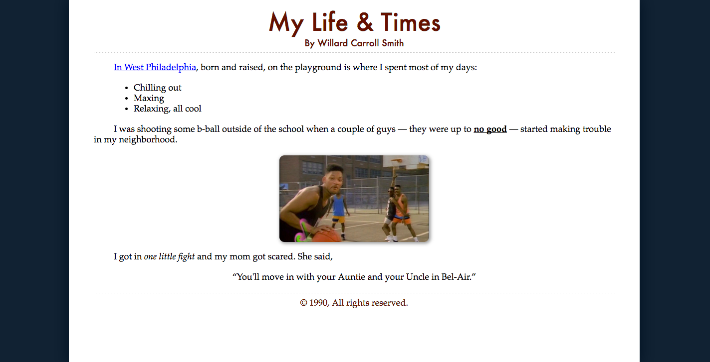

## Lesson Objectives

1. Describe the roles that HTML and CSS play for a web page
2. Identify the components of an HTML element and an HTML document
3. Utilize HTML validators to write correct HTML documents
4. Describe some common elements and their use cases
5. Design a HTML document based off a mockup, with a structure that maintains the semantics of the information  

## Sublime plugins to install

* W3CValidators
* HTMLSnippets

## What is HTML?

HTML stands for HyperText Markup Language, and describes the structure of a web page. HTML consists of elements, which are represented by tags.

HTML elements look like this:

```html
<div></div>
<div>Some Content</div>
<p>A paragraph</p>
```

HTML defines the _structure_ of a web page. CSS defines the _style_.

### Block vs Inline Elements

Some HTML elements can contain other HTML elements. These are called "block elements":

```html
<div>
	<p>Hello!</p>
</div>
```

> Save this in a file called `index.html` and open the file in a browser.

Elements that should not contain other elements are called "inline elements".

Some block elements: `div, p, h1, h2, ol, ul, form, table`

Some inline elements: `a, b, i, small, strong, img, button, input, label`

#### Which HTML is correct?

```html
<h2>
    <a href="www.google.com"> Hello </a>
</h2>

<a href="www.google.com">
    <h2>Hello</h2>
</a>
```

### Element Attributes

An HTML element can also have attributes. For example:

```html
<a id="my-link" href="www.google.com">Click Me!</a>
```

Attributes define special properties for an HTML element. For the previous example, this anchor element has an id of `my-link` and navigates the browser to `www.google.com`.

### Void Elements

Void elements do not require a closing tag. For example,

```html
</img>
```

is redundant. You can just do ``.

Some void elements: `br, img, input, link, meta`

### Components of an HTML Document

An HTML document consists of three things:

* doctype
* head
* body

```html
<!DOCTYPE html>
<html>
<head>
	<title>Page Title</title>
</head>
<body>
	<h1>My First Heading</h1>
	<p>My first paragraph.</p>
</body>
</html>
```

Browsers render web pages by reading an HTML document. The `<head>` element provides metadata about the page, the `<body>` provides the content to display, and the `doctype` tells the browser what HTML version the document is written in.

Nothing in the `<head>` is displayed in the content area for the screen.

The elements within `<body>` will display on the screen. In the above example, there is one header element followed by a paragraph.

Your `doctype` should always be `<!DOCTYPE html>` - this is how you define the document to be HTML5.

### Our First Web Page

Create a new file `index.html` and open it in Sublime.

We will create a personal biography using only the elements we have seen so far. Give your web page a meaningful title, and for the content provide three headers and paragraphs, one each for: an introduction, summary of your hometown, and your favorite hobby.

## Headers: HTML Document Metadata

A document's metadata is the information that describes the document itself. For example: what is the title? what styling should it use? who wrote it?

```html
<head>
    <meta charset="utf-8">
    <meta name="description" content="">
    <meta name="viewport" content="width=device-width, initial-scale=1">
    <title>Hello World</title>
    <link rel="stylesheet" href="css/style.css">
    <link rel="author" href="www.github.com/hoten">
</head>
```

<link rel="stylesheet" type="text/css" href="theme.css">

## Common Structural Elements

### `<div>`

Used to group together other elements. Defines a divison/section of a page.

### `<a>` anchor

Used for linking to other pages, or other parts of the same page.

The `href` attribute defines the link to navigate to. You can also define a link that jumps to another part of the same page. To do that, set the `href` to `#id`, where "id" is the matching `id` of some element on the page.

`<a href="#intro">Jump to introduction</a>`

> Create a table of contents for your bio. Provide a link for each section of your page

### `<p>` paragraph

### `` image

``

Image tag attributes include: src (link to the image to display), alt (text to display when hovering), and height, width (which may be ommitted).

> Add an image to your bio

### `<ul>`, `<ol>`, `<li>` lists

`<ul>` is an unordered list, `<ol`> is an ordered list. The former uses bullets, the latter uses numbers. Inside these elements lives `<li>` list elements.

```html
<h1>Groceries List</h1>
<ul>
	<li>Beans<li>
	<li>Eggs<li>
	<li>Bread<li>
</ul>

<h1>Directions To The Store</h1>
<ol>
	<li>Get In Car<li>
	<li>Drive To Store<li>
	<li>Get Out Of Car<li>
</ol>
```

> Somewhere in your bio, provide a list of your favorite things

### Styling Elements

## Semantics

There are a number of HTML elements that act much like `<div>`s, but provide additional meaning to the developer/browser. Some include:

`<header> <footer> <nav> <section> <article>`

### Why Semantic Elements?

Pre-HTML5, developers used their own id/class names to style elements: header, top, bottom, footer, menu, navigation, main, container, content, article, sidebar, topnav, etc.

This made it impossible for search engines to identify the correct web page content. Additionaly, screen readers had a lot of trouble conveying content to visually impaired users.

New HTML5 elements make it easier to convey the semantics (meaning, logic) of a document.


The structure of this page is much clearer than if everything were just divs.

### When to use what?

#### `<header>`

Use this for details you might have at the very beginning of a section of your page. You would commonly restrict this to one, maybe two header tags, and possible a `nav` element (so, a table of contents).

#### `<footer>`

Use this for the bottom of the content, this might provide some publication information or copyright notices.

#### `<nav>`

This element should provide links to other parts of the page/website.

#### `<article>`

These are for self-contained, complete resources. Anything that can be published to a newspaper or RSS feed. Example: blog posts, forum posts, magazine articles.

#### `<section>`

This is a more generic way to group together related content on a page. If `<nav>`, `<article>`, or `<aside>` is not a choice, `<section>` might be what you want.

#### Can I still use divs?

Yes! These elements are for outline the document in broad strokes. You can still use divs to structure the document further within these elements.

> Can you use some of these elements in your bio page?

## This is a story ...

Let's recreate this image using the HTML elements we have learned so far. Use the CSS provided.



## Reading Material

* http://line25.com/articles/10-html-tag-crimes-you-really-shouldnt-commit
* https://www.w3.org/wiki/HTML_structural_elements

