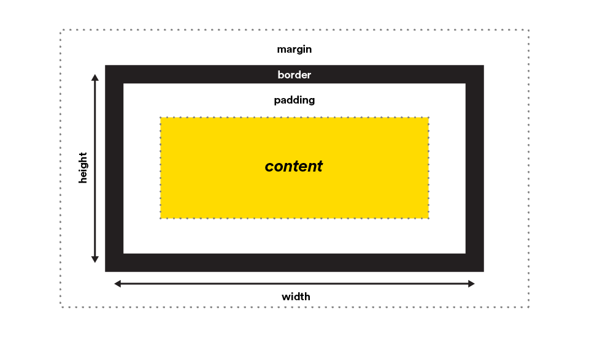
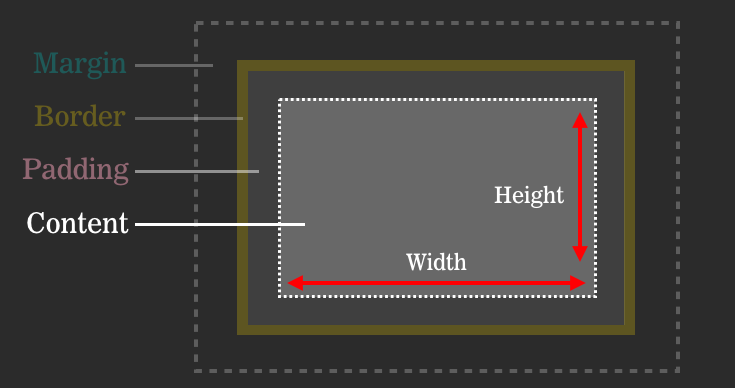
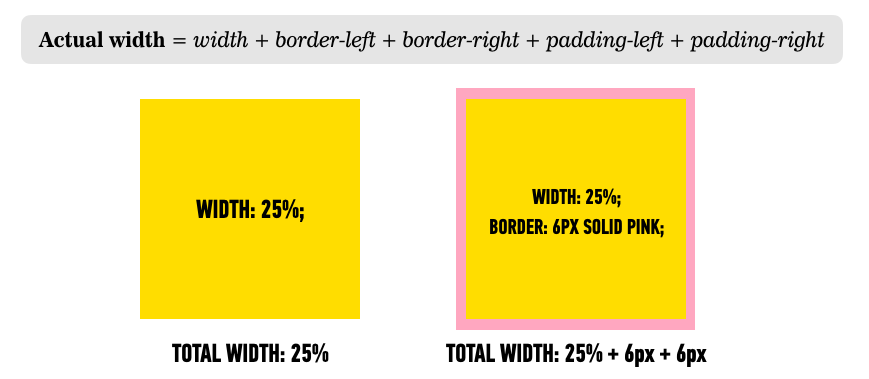
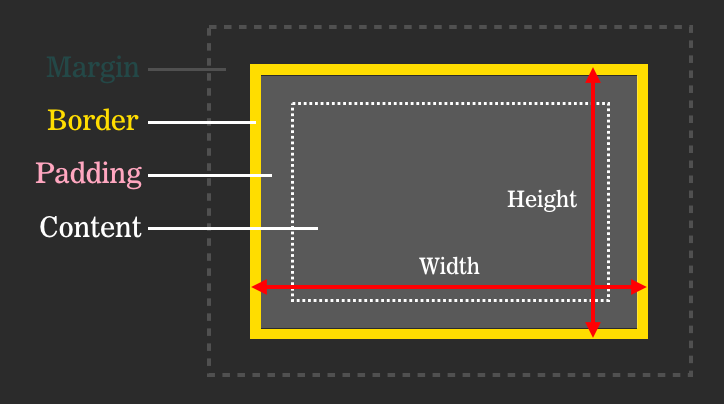
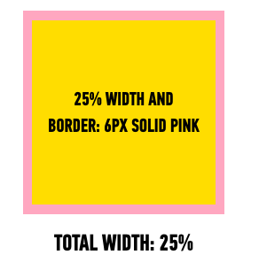
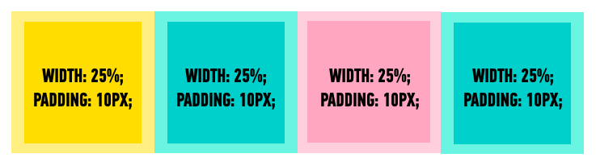

#  Box Model (30 min)

| Timing | Type | Topic |
| --- | --- | --- |
| 10 min | [Introduction](#introduction-box-model) | Box Model |
| 20 min | [Demo/Codealong](#demo-box-model) | Box Model Demo |

### LEARNING OBJECTIVES
*After this lesson, you will be able to:*

- Use the box model to style element borders and structure your page.
- Understand the value of `box-sizing: border-box;` and apply it to page layout as needed.
- Adjust element spacing using padding and margins.


### INSTRUCTOR PREP
*Before this lesson, instructors will need to:*

- Have students open the entire `starter-code` folder in a text editor.
- Optional: Gather a cardboard box, along with packing peanuts or newspaper.

> Instructor Note: There's a helpful way to demonstrate this concept and help students remember its order: a cardboard box with some sort of padding (newspaper, packing peanuts, etc.) and any content you might ship (a plate, bowl, etc.). The cardboard box represents the border; the packing peanuts represent the padding around whatever content you put in the box; and the margin is the space between the box and other objects.

***

<a name="introduction-box-model"></a>
## Introduction: Box Model (5 min)

All HTML elements can be considered boxes. Even if you see a circle, it's living within a box.

The CSS box model describes this principle: a box wraps around all HTML elements, including margins, borders, padding, and the content itself. This model allows us to place a border around elements and space them in relation to other elements. Using CSS properties and values, it's possible to apply specific styles to each of these elements and change the way they behave and/or display on the page.

#### Layout: Turn & Talk (5 min)
- Install the <a href="https://chrome.google.com/webstore/detail/pesticide-for-chrome/bblbgcheenepgnnajgfpiicnbbdmmooh">Pesticide Chrome Extension</a>, which visualizes all DOM elements as boxes.
- Work with a partner to investigate a few different websites using the extension, and discuss how the box model might help you control their layout.

***

<a name="demo-box-model"></a>
## Demo/Code-Along: Box Model Demo (20 min)

Let's write some code to help us visualize the box model. 

Open [starter-code/box-model](starter-code/box-model) in your text editor, and open the `index.html` file in your browser.

Dynamite! Now navigate to your Developer Tools; under the elements tab, hover over each of the elements. What do you notice? A "box" is highlighted in your browser!

What happens when we drop this code into the CSS file?

```css
* {
    border: 1px solid red !important;
}
```

The universal selector ```* { }``` is a great way to apply a style to every element on a page *without* using inheritance. We'll teach you more about this selector in a later lesson. For now, know that it helps us see the boundaries of different elements. Pay special attention to how much space the elements take up on a page, and how that space differs for block and inline elements.


### Box Model Components
The image below illustrates the box model. You should have seen this in your dev tools:



But what do these different layers mean, and how are they related to one another?

- **Margin:** Clears an area around the border (or the boundaries of the padding if there is no border). The margin does not have a background color; it is completely transparent. 
- **Border:** A border that wraps around the padding and content. The border is affected by the background color of the box, unless a color is declared.
- **Padding:** Clears an area around the content; it's the space between the content and the border. The padding is affected by the background color of the box.
- **Content:** The content of the box; this is where text and images appear.

Let's go into some more detail and practice with each of the box model's elements.


#### Margin
The margin is the space around the element. The larger the margin, the more space between our element and the elements around it. We can adjust the margin to move our HTML elements closer to or farther from each other.

Adjusting our margins not only affects our element's proximity to other elements on the page, but also its proximity to the "walls" of the HTML document. For example, if we declare the width of our ```<div>``` and set its margin to `auto,` this tells the document to automatically put equal left and right margins around our element. The equal left and right margins are calculated based on the width of the document, centering the element on the page.

```css
div {
  width: 40em;
  margin: 4em auto;
}
```

If you want to specify a particular margin on a particular side, you can do so like this:

```css
div {
  margin-top: /*some value*/ ;
  margin-right: /*some value*/ ;
  margin-bottom: /*some value*/ ;
  margin-left: /*some-value*/ ;
  }
```

You can also set an element's margins all at once using shorthand, which reads clockwise around the content (top, right, bottom, left):

```css
div {
  margin: 1px 2px 3px 4px;
}
```

> Note: A helpful way to remember this order is **TR**ou**BL**e — top, right, bottom, left.

You'll typically use 1-2 values with the margin property, where one value controls all four margins and two values control the top and bottom, and left and right margins, respectively. For more on shorthand, read <a href="https://developer.mozilla.org/en-US/docs/Web/CSS/Shorthand_properties">MDN</a>.

```css
div {
  margin: 40em auto; /*top & bottom margins are 40em; left & right margins are auto*/
}

p {
  margin: 2em; /*all margins 20px*/
}
```

#### Border
The border is the edge of the element. It's what we make visible every time we set the border property. You can use shorthand for setting ```border```, just like we did with ```margin```. Let's add a border to our ```<div>```:

```css
div {
  width: 40em;
  margin: 4em auto;
  /* Border shorthand: */
  border: 1px solid #000;
  /*
  border-width: 1px;
  border-style: solid;
  border-color: #000;
  */
}
```

#### Padding
The padding is the spacing between the content and the border.

Whereas `margin` is typically used to push elements away from each other, padding is used to create space between the content (usually text) and the border, or increasing the area of a box's `background-color`.

We can adjust padding to move the border (or boundaries of our box) closer to or farther from the content. Shorthand can be used with padding, as well. Let's try to some changes to our ```div```.

```css
div {
  width: 40em;
  margin: 4em auto;
  border: 1px solid #000;
  padding: 2em;
}
```

Much better! The text is more readable, and the page itself has more visual balance. What if our ```div``` has a background color and no border?

```css
div {
  width: 40em;
  margin: 4em auto;
  /* border: 1px solid #000; */
  padding: 2em;
  background: #eee;
}
```

Our container still looks great!

**Important Note**:

By default, the `width` and `height` declared for an element only include the content.



Declaring width using the default `box-sizing` value of `content-box` (this will be applied if you don't declare `box-sizing` in your CSS) means that width determines the width of the **content** *only* (hence the name `content-box`). 

Adding padding and a border will increase the width of your element, even if you've *declared* the width. 




So in the CSS in the example in the "padding" section, we see the width set to `40em`, and the padding on each side set to `2em`. What is the actual width of this element? What would the width be if we kept the border declaration?

- `44em` width + `4em` padding
- `44em` width + `4em` padding + `2px` border (We can't calculate without knowing the base size of `em`.)

This width increase can cause frustration and confusion when we start to create column-based layouts. 

You may want to consider using `box-sizing: border-box;`, which ensures that the width you declare is the final width of the entire element, including content, padding, and border. 



By setting the value of `box-sizing` to `border-box`, the width will include everything from the **border** inwards (hence the name `border-box`).



You can imagine how this would be useful for a multi-column layout, where we want to be able to set a width that includes padding and a border for each column:



Read more about the `border-box` method [here](https://www.paulirish.com/2012/box-sizing-border-box-ftw/).

***

### Hungry for more?
#### Exercises
- [Box Model](exercises/box-model/starter_code/tags_boxes)
  - [Check your work!](exercises/box-model/solution/tags_boxes)

#### Videos
- [CSS Box Model](https://www.youtube.com/watch?v=HNgdhp1_kEE&list=PLdnONIhPScST0Vy4LrIZiYKpFNoxgyH7J&index=6)

#### Readings
- [* { Box-sizing: Border-box } FTW](https://www.paulirish.com/2012/box-sizing-border-box-ftw/)
