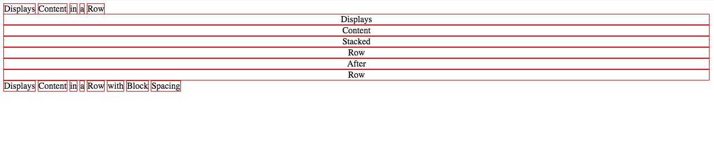
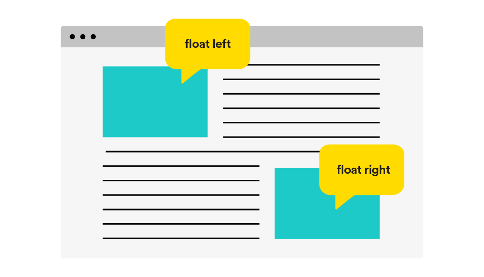
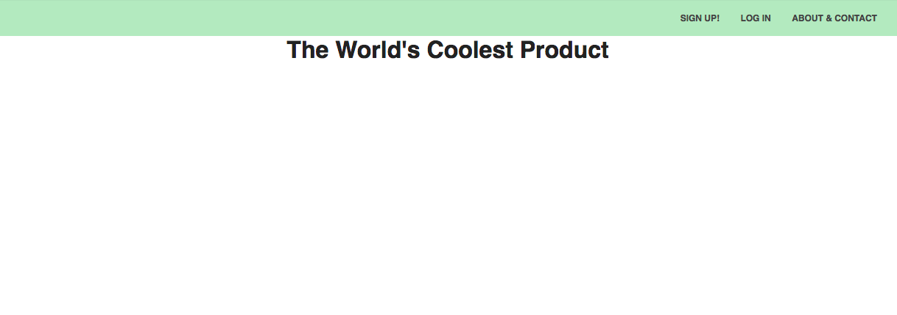
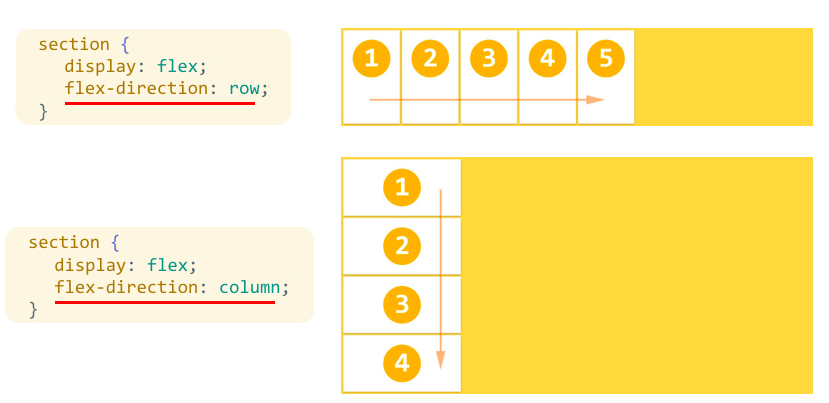
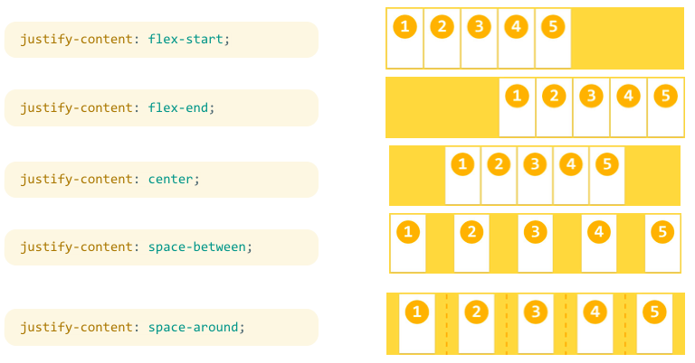
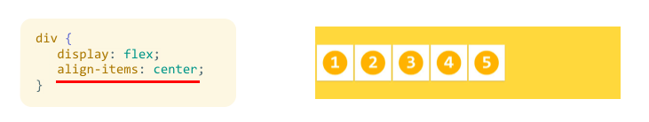
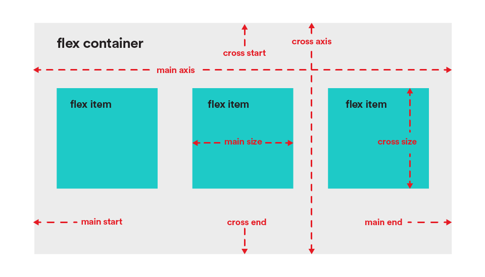
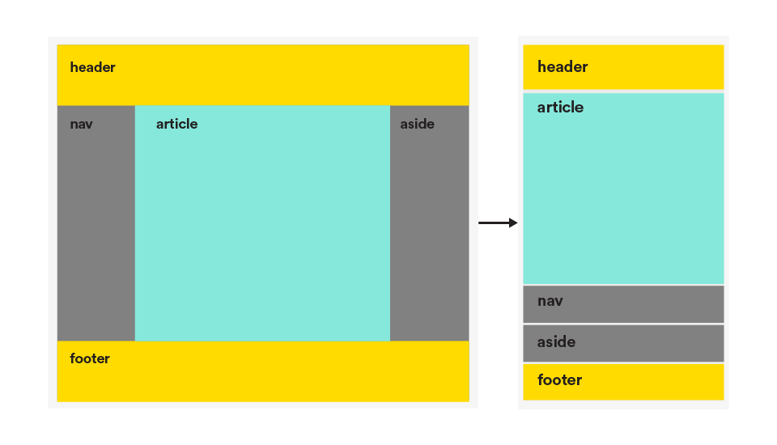

#  Flexbox (60 mins)

| Timing | Type | Topic |
| --- | --- | --- |
| 5 mins | [Introduction](#introduction) | Flexbox |
| 5 mins | [Refresher](#display) | Display |
| 5 mins | [Refresher](#floats) | Floats |
| 20 mins | [Demo/Codealong](#demo-flexbox) | Flexbox Demo |
| 25 mins | [Independent Practice](#ind-practice) | Flex Your Code Muscles |

### LEARNING OBJECTIVES
*After this lesson, you will be able to:*

- Adjust element spacing using padding and margin.
- Describe the difference between block, inline, and inline-block elements.
- Use flexbox to set up a grid system.

***

<a name="introduction"></a>
## Introduction: Flexbox (5 mins)
From [MDN](https://developer.mozilla.org/en-US/docs/Web/CSS/CSS_Flexible_Box_Layout/Using_CSS_flexible_boxes): "The CSS3 Flexible Box, or flexbox, is a layout mode providing for the arrangement of elements on a page such that the elements behave predictably when the page layout must accommodate different screen sizes and different display devices."


***

<a name="display"></a>
## Refresher: How Display Affects Spacing & Layout (5 mins)

> Instructor note: Demo for students. Some example code can be found [here](examples/display_demo).

We just learned that each HTML element gets its own box to live in. Cool, right?

As you saw, the outermost box of each element went all the way across the page. This is why, until now, your HTML elements have been sitting on top of one another: by default, they take up the full width of the page. We can change all this with the first positioning property we'll learn, the `display` property, and the four values we can use:

- `inline`
- `block`
- `inline-block`
- `none`

An **inline element** has no line break before or after it. This makes the element sit on the same line as another element; but without formatting, it looks like a block. It only takes up as much width as it needs (not the whole line). Inline places all your elements on a single line. The bad news is that it doesn't maintain their "box"ness, so exciting techniques like centering with `margin: auto;` are not possible with inline elements.

> Instructor note: Open the [demo](examples/display_demo) page in your browser to the Developer Tools > Elements panel and try to update the width/height in the styles panel for an inline element. This will show students how the width, height, padding, and margin don't affect inline elements the way we would expect them to.

A **block element** has some whitespace above and below it, and does not tolerate any HTML elements next to it without further styling. This makes the element a block box. It won't let anything sit next to it on the page and takes up the full width.

An **inline-block element** is _placed_ as an inline element (on the same line as adjacent content), but it _behaves_ like a block element. This makes the element a block box, but will allow other elements to sit next to it on the same line.

By setting the value for `display` to `inline-block`, the element will sit next to other elements; but we can now set a width, height, padding and margin, and have them behave as we would expect.

> Instructor note: Open the [demo](examples/display_demo) page in your browser, go to the Developer Tools > Elements panel, and demo for students how the width/height/padding/margin can be updated after adding `display: inline-block;` to an inline element.

If you assign `none` as the value of the `display`, this will make the element and its content disappear from the page entirely!

To illustrate all ```display``` values, consider this HTML:

```html
    <div class="inline">Displays</div>
    <div class="inline">Content</div>
    <div class="inline">in</div>
    <div class="inline">a</div>
    <div class="inline">Row</div>

    <div class="block">Displays</div>
    <div class="block">Content</div>
    <div class="block">Stacked</div>
    <div class="block">Row</div>
    <div class="block">After</div>
    <div class="block">Row</div>

    <div class="inline-block">Displays</div>
    <div class="inline-block">Content</div>
    <div class="inline-block">in</div>
    <div class="inline-block">a</div>
    <div class="inline-block">Row</div>
    <div class="inline-block">with</div>
    <div class="inline-block">Block</div>
    <div class="inline-block">Spacing</div>

    <div class="none">Displays nothing!</div>
```

With this CSS:

```css
div {
  border: 1px solid red;
  text-align: center;
}

.inline {
    display: inline;
}

.block {
    display: block;
}

.inline-block {
    display: inline-block;
}

.none {
    display: none;
}
```

We would end up with something like this:



***

<a name="floats"></a>
## Refresher: Floats (5 mins)
You've likely used floats in the past to build column layouts, but flexbox is now considered best practice for grid layouts. However, sometimes our layout goals are simpler; rather than pinpointing the position of an element, we may just want to move it to the left or right side of a page. We accomplish that using `float`.

A basic example you'll encounter in most tutorials is the "text wrap," or surrounding an image with text:


```html
<section>
    <p>
      
      Lorem ipsum dolor sit amet, consectetur adipisicing elit. Libero rerum quaerat ut voluptatibus repudiandae ad animi rem quas. Eius temporibus explicabo error labore adipisci. Voluptatem iure enim aspernatur dolor, placeat.
      
      Lorem ipsum dolor sit amet, consectetur adipisicing elit. Libero rerum quaerat ut voluptatibus repudiandae ad animi rem quas. Eius temporibus explicabo error labore adipisci. Voluptatem iure enim aspernatur dolor, placeat.
    </p>
</section>
```

```css
section {
    width: 30em;
    margin: auto;
}

img {
    padding: 1em;
}

p img:first-of-type {
    float: left;
}

p img:last-of-type {
    float: right;
}
```

* Images are, by default, `inline` elements.
* To remove them from that flow and re-position them, we set `float` to either `left` or `right`.
* We can also do this with multiple images with similar or varying `float` values.

### Clear
Floating, without the use of `clear`, can cause some serious layout issues. Let's look at an example using a page header.

Here's how we want the site to look:


So we go about coding:

```html
<header>
    <nav>
        <a href="#">Sign Up!</a>
        <a href="#">Log in</a>
        <a href="#">About & Contact</a>
    </nav>
</header>
<main>
    <h1>The World's Coolest Product</h1>
</main>
```

```css
* {
    margin: 0;
    padding: 0;
    box-sizing: border-box;
}

body {
    margin: 0;
    font-family: sans-serif;
}

header {
    background: #BEE5BF;
    padding: 1em;
}

nav {
    float: right;
}

nav a {
    color: #444;
    text-transform: uppercase;
    font-family: sans-serif;
    font-size: .75em;
    font-weight: bold;
    text-decoration: none;
    margin: 1em;
}

h1 {
    color: #222;
    text-align: center;
}

* {
    margin: 0;
    padding: 0;
    box-sizing: border-box;
}
```

Why do we see this?


The floated `nav` has collapsed its parent `header` element, and shifted the `h1`. This is the nature of floats: they cause their parent element to collapse, which causes 'gaps' in the layout. Other elements, such as our `h1` in this example, will attempt to move into those gaps. This is a small example of something that can cause large layout issues!

### Enter: The Clearfix
[Nicolas Gallagher](http://nicolasgallagher.com/micro-clearfix-hack/) created a technique that eliminates the bad practice issues that `clear: both;` causes, simply by adding a class to the parent container. And because it's a class, it's reusable!

Applying it to our code would simply mean adding the class to our `header`:

```html
<header class="cf">
    <nav>
        <a href="#">Sign Up!</a>
        <a href="#">Log in</a>
        <a href="#">About & Contact</a>
    </nav>
</header>
<main>
    <h1>The World's Coolest Product</h1>
</main>
```

Ta-da!

***


<a name="demo-flexbox"></a>
## Demo / Codealong: Flexbox Demo (20 mins)
We'll be using flexbox to build our column-based grid layouts. In addition to creating an incredible structure on our page, flexbox solves a lot of layout issues that `float` either causes or cannot solve (or both!).

### Problem 1: Vertical Alignment

> Instructor note: Demo for students. Some code to use for a demo can be found [here](examples/vertical_centering).

I have a div. I would like to center it vertically and horizontally on my page. Seems simple enough, right?

#### You tell me: What should I try?

Here's some starter code:

```html
<body>
  <div>This is my div!</div>
</body>
```

```css
html {
  height: 100%;
}
body {
  min-height: 100%;
  background-color: #ccc;
  margin: 0 auto;
}
div {
  width: 100px;
  height: 100px;
  outline: 1px solid red;
}
```

This problem has been the laughingstock of CSS for years: How can something so obvious be so difficult to accomplish?

### Flexbox to the Rescue

```css
html {
  height: 100%;
}

body {
  min-height: 100%;
  background-color: #ccc;
  margin: 0 auto;
  display: flex;
  flex-direction: row;
  justify-content: center;
  align-items: center;
}

div {
  width: 100px;
  height: 100px;
  outline: 1px solid red;
}
```

#### How it works

When you declare `display:flex` on a container, it becomes a **flex container**.

First, you use `flex-direction` to indicate whether you want the items in the container -- the **flex items** -- to "read" left-to-right (`row`), right-to-left (`row-reverse`), top-to-bottom (`column`), **or** bottom-to-top (`column-reverse`).




When you specify a flex-direction, you can think of it as placing an axis in that direction across your flex container. So if you use `flex-direction: row;` or `row-reverse`, this **main axis** will be the same as the X-axis (horizontal) on a graph. Otherwise, it'll be the Y-axis.

Then you determine how you want to align or **justify** the items along this main axis using the `justify-content` property. It'll do nice things for you, such as let you put even spacing between all the items (`spacing-between` and `spacing-around`).



Finally, you control how you align the items along the axis that goes across the main axis -- the **cross axis**, if you will -- with the `align-items` property. If you have `flex-direction: row;`, the main axis is the X-axis, and the cross axis is the Y-axis.



Lastly, you can also do nice things, such as control how you want things to line up across the cross axis, by using `align-content` such as `space-between` and `space-around`.

### Problem 2: Make the footer stick

I want my footer to lie along the bottom of my page.

#### You tell me: What should I try?

Starter code:

```html
<body>
  <header>This is my header.</header>
  <main><p>Blah blah blah blah blah...</p></main>
  <footer>This is my footer!</footer>
</body>
```

```css
html {
  height: 100%;
}

body {
  min-height: 100%;
  background-color: #ccc;
  margin: 0 auto;
}

footer {
  width: 100%;
  height: 50px;
  background-color: #888;
}
```

Making the footer lie against the bottom of my *screen* is pretty easy: I can just use absolute or fixed positioning. However, using absolute or fixed positioning means everything else on the page ignores my footer. The text of my `main` could easily run under my footer. I want the text of my `main` to "push" my footer to the end of the page.

### Flexbox to the rescue.

```css
html {
  height: 100%;
}

body {
  min-height: 100%;
  background-color: #ccc;
  margin: 0 auto;
  display: flex;
  flex-direction: column;
}

footer {
  width: 100%;
  height: 50px;
  background-color: #888;
}
```

#### What's the main axis on here? The cross axis?



Four more terms: the **main start** (`flex-start`), where the start of the main axis is; the **main end** (`flex-end`); and the cross starts and ends.

#### Recap

- `justify-content`: Align along flex-direction (main axis).
- `align-items`: Align along not-flex-direction (cross axis).
- `align-content`: Space things along main axis.
- `flex-basis`: How big the flex items "want" to be.
- `flex-shrink`: If the flex container is too small to accommodate all the flex bases, the proportion a particular flex item will occupy.
- `flex-grow`: If the flex container is too big for all the flex bases, the proportion a particular flex item will occupy.
- `order`: The order in which you want flex items to appear along the main access. The default is 0. Negative numbers are allowed.

In particular, let's look at...

### The Holy Grail Layout



This is something you know well, even if you don't recognize the term. It describes a webpage with a header bar, a footer bar, and three columns along the middle: a wide "main" column, a navigation column on the left, and an advertisement, site map, or extra info column along the right.

Obviously, this layout won't work on tiny screens (unless you really like super-skinny columns). It's common to stack things on top of each other for mobile views to make one single column.

Before flexbox, this involved a lot of pushing and shoving with dimensions and positioning. You would essentially have to write two completely separate stylesheets: one for mobile, and one for desktop.

With flexbox, just change the `flex-direction` for smaller screen sizes, and you're pretty much done!

```css
body {
  display: flex;
  flex-direction: row;
}

/* We'll talk more about media queries soon. For now, just understand that this rule for `body` applies to screens `480px` wide and below.*/

@media screen and (max-width: 480px) {
  body {
    flex-direction: column;
  }
}
```

> Note: [CSS Grid](https://css-tricks.com/snippets/css/complete-guide-grid/) is also on the horizon, and will be supported by-default by some browsers, such as Chrome and Firefox, by March. Once fully supported, it will provide us with yet another helpful tool to control the layout of our pages.


***

<a name="ind-practice"></a>
## Independent Practice: Flex Your Code Muscles (30 mins)
Using the [provided HTML](ind-practice/starter-code), code the CSS for the mockup below using flex. Pro Tip: always work 'big to small.' Get the layout and position of elements finished first, then move on to details such as fonts and colors.


***

## Hungry for more?
### Exercises
- [Display property exercise](exercises/display_lab/starter_code) (Beginner - 10 mins)
- [Build a Mondrian](https://googlecreativelab.github.io/coder-projects/projects/mondrian/)
- [Flexbox Froggy](http://flexboxfroggy.com)
- [Flexbox Defense](http://www.flexboxdefense.com)
- [Flexplorer](http://bennettfeely.com/flexplorer/)
- [Hyrule Potion Shop](hyrule-potion-shop)
- [Flexbox in 5](https://cvan.io/flexboxin5/)

### Videos
- [CSS Display](https://www.youtube.com/watch?v=qjSe_K3agYc&list=PLdnONIhPScST0Vy4LrIZiYKpFNoxgyH7J&index=7)
- [CSS Floats](https://www.youtube.com/watch?v=-4Yy3WNmvmg&list=PLdnONIhPScST0Vy4LrIZiYKpFNoxgyH7J&index=11)
- [CSS Flexbox Intro](https://www.youtube.com/watch?v=tqdqEiTlqF0&list=PLdnONIhPScST0Vy4LrIZiYKpFNoxgyH7J&index=33)
- [CSS Flexbox: Wrap, Justify, Align](https://www.youtube.com/watch?v=7d8aAw8mzjI&index=34&list=PLdnONIhPScST0Vy4LrIZiYKpFNoxgyH7J)
- [CSS Flexbox: Child Properties](https://www.youtube.com/watch?v=zDYAbI78dzc&list=PLdnONIhPScST0Vy4LrIZiYKpFNoxgyH7J&index=35)
- [Flexbox Problem Solving Part 1](https://www.youtube.com/watch?v=wBlBTO7mqoI&index=109&list=PLae1he6d1WImFXtLgPt7MDAx6k6iP59EW)
- [Flexbox Problem Solving Part 2](https://www.youtube.com/watch?v=_I58MXDnBEs&index=110&list=PLae1he6d1WImFXtLgPt7MDAx6k6iP59EW)

### Readings
- [MDN Flexbox](https://developer.mozilla.org/en-US/docs/Web/CSS/CSS_Flexible_Box_Layout/Using_CSS_flexible_boxes)
- [A Visual Guide to CSS3 Flexbox Properties](https://scotch.io/tutorials/a-visual-guide-to-css3-flexbox-properties)
- [Solved By Flexbox](http://philipwalton.github.io/solved-by-flexbox/)
