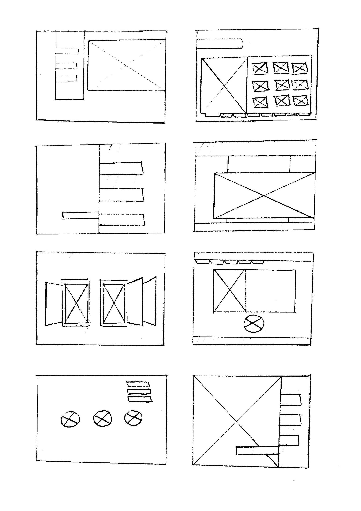
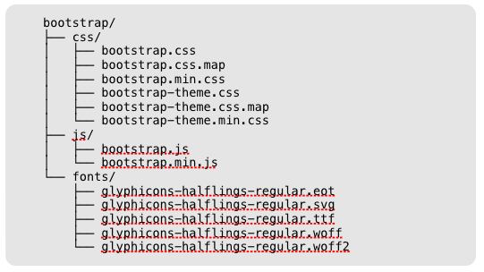
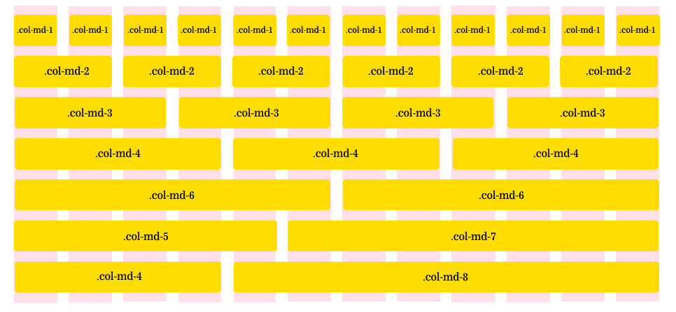

#  Wireframes, Layouts and Grid Systems (90 mins)

| Timing | Type | Topic |
| --- | --- | --- |
| 10 mins | [Introduction](#introduction-wf) | Wireframes |
| 10 mins | [Introduction](#introduction-grids) | Grid Systems |
| 30 mins | [Demo/Codealong](#demo) | Building a Grid |
| 40 mins | [Guided Practice](#guided-practice) | Match That Grid |
| 20 mins | [Introduction](#bootstrap) | Bootstrap (If time permits)|

### LEARNING OBJECTIVES
*After this lesson, you will be able to:*
- Describe what a wireframe is and its role in the development process.
- Describe the differences between low/medium/high-fidelity markups.
- Create a wireframe to define the layout and user flow for your app.
- Adjust layout based on hierarchy of content.
- Describe how style guides, grid systems, and media queries relate.
- Describe the grid system.

---

<a name="introduction-wf"></a>
## Introduction: Wireframes (10 mins)

Wireframes illustrate how the user interfaces with information. A wireframe answers questions as general as _"How does a user access the About page?"_ and as specific as _"What will change on the screen if the user clicks 'submit'?"_ Most wireframes are free of any color or visual design elements, and simply show boxes and lines with notations to outline user interactions.

Wireframes will look different depending on who creates them, but they should always include details about the functionality.


### Wireframes in the Wild
As a developer, you'll often build pages and sites from wireframes created by User Experience (UX) Designers. Wireframes should detail any and all functionality on the page. If building a website was like building a house, wireframes might be considered the blueprints. They're an important element of communication between the design and engineering teams.

### Want to Create Your Own?

#### Thumbnail Sketches
Wireframing before you build a page or site can be a helpful exercise in planning the functionality and basic layout, especially if your team doesn't have UX Designers. Low-fi wireframes, often called thumbnail sketches, are an easy and quick way to begin. Thumbnail sketches are meant to be drawn quickly, as a way to prototype different layouts for your content. They consist of very simple boxes and lines to represent different elements on the page.


[via sopachu.wordpress.com](https://soapchu.wordpress.com/category/traditional-illustrations/)

#### User Stories
You might also start by creating User Stories. Imagine 3-4 different types of users who will come to your site. Is this a first-time user? A user hesitant to sign up? A user who's been a member of the site for years? How will these personas influence the functionality of your site?

Assuming the identity of these users, ask yourself these questions as you sketch out your site:

- Will the users understand what this product or service does?
- Is the hierarchy of content appropriate for this user's needs?
- Does the user have a clear way to navigate the site from the home page? From all subpages?
- Can the user intuitively interface with the information presented to them?

The best way to see if your site is usable is to test, test, test, test! A simple exercise is to have someone look at wireframes and talk through how they would use the site. Pay close attention to small moments of hesitation or larger moments of confusion, which often reveal issues with the site.

### Tools of the Trade
UX Designers use a number of tools to create wireframes, but basic wireframes can also be done by hand or on a whiteboard. Feel free to try out a few common tools in your spare time!

- [Sketch](https://www.sketchapp.com/)
- [Framer](https://framerjs.com/)
- [Moqups](https://moqups.com/)
- [Adobe Illustrator](http://www.adobe.com/products/illustrator.html)
- [OmniGraffle](https://www.omnigroup.com/omnigraffle)
- [Wireframe.cc](https://wireframe.cc/)

***

<a name="introduction-grids"></a>
## Introduction: Grids (10 mins)
### Why use a CSS grid?

#### Structure
* Grids are a simple way to apply layout to a webpage. A better layout improves the user experience.
* Grids help avoid stressful CSS debugging by starting out on the right foot.

#### Reusability
* Grids make the layout process easier because of reusable, semantically-named "utility classes" (i.e., a library of CSS class selectors).
* Grids aren't limited to a particular project. We can apply them to pretty much everything we do.
* Grids are highly customizable. You can really make them your own.

_Even if you don't use a grid system, these concepts will translate across other layout problems._

### Basic components of a grid

#### Rows
* The highest-level component of a grid.
* Comprised of columns.

#### Columns
* Contain and separate site content.

#### Gutters
* Provides spacing between our columns. Optional, but useful.

### Opening Exercise (10 minutes)

Whiteboard a wireframe for [Craigslist](http://washingtondc.craigslist.org/).

* Focus on the main components of the page: sections that are defined by the rows and columns of our grid.
* Don't worry about site content (e.g., text, images).
* Keep an eye out for width, height, proportion, and number of components.
* [Sample wireframe.](http://www.comentum.com/images/wireframes-sample/ecommerce/home.png)

<!--The transition between the "whiteboard a wireframe" exercise and the demo seems a little disjointed. Can you provide a little explanation about why we are moving from one to the other? -->

<a name="demo"></a>
## Demo / Codealong: Building a Grid (30 mins)
### Create HTML document

Open [starter-code/grid-system/starter-code](starter-code/grid-system/starter-code) in your text editor. You'll want to open the `index.html` file as well as the `style.css` file. Some basic HTML has been added for you.


### Define Column and Row Selectors

Let's start by creating `.column` and `.row` class selectors in the `style.css` file.
* These will contain properties that all rows and columns, regardless of size, will possess.

```css
.row, .column {

}

.row {
  /* Let's add a border so we can see our rows better */
  border: 1px solid #000;
}

.column {
  /* Let's add another border so we can see our columns better */
  border: 1px solid #ff0000;
}
```
* Take a minute or two to create some rows and columns in `index.html`, using the class selectors we just made.

```html
<body>
  <header class="row">
    <div class="column">Something</div>
    <div class="column">Something</div>
    <div class="column">Something</div>
  </header>
  <div class="row">
    <div class="column">Something</div>
    <div class="column">Something</div>
    <div class="column">Something</div>
  </div>
  <footer class="row">
    <div class="column">Something</div>
    <div class="column">Something</div>
    <div class="column">Something</div>
  </footer>
</body>
```

Before we start defining widths and giving our grid system some versatility, we need to take care of a few things.

### Box-Sizing

What is the default definition of `width`?
* width = content

We want to be able to explicitly define our column widths so that they also include `border` and `padding`.

* `width` = `content` + `padding` + `border`
* This way, we know exactly how wide our columns will be.
* Remember, we can do this by changing the `box-sizing` property of our `.row` and `.column` selectors to `border-box`.


### Define Column Behavior
So our rows are actually good to go!

* They're just horizontal containers.
* Thanks to clearfix, we don't need to worry about content overflow.
* Our columns will handle page width. Let's work on that now...

```css
.column {
  float: left;
}
```

Let's give our rows and columns a spin.


What does this look like?
* What functionality do we currently have? What do we need to add?


Right now, we can...

* **Separate content into rows and columns.**
  * What does it look like when we turn `float` off?
  * How about without clearfix?

We need to...

* **Set column widths.** We don't necessarily want our column widths to be defined by their content.
* **Define total width.** In any scenario, we want our total grid width to cover the entire page.
* **Give everything some space.** Our grid will look better if we give our rows and columns some breathing room.


### Create Columns with Specific Widths

So we want to define our column widths not by the width of their content, but by how much of the page we want them to take up.

* Example: a sidebar nav that takes up 1/6 of total page width.
* This is actually a topic of debate. Learn more [here](http://alistapart.com/article/content-out-layout).

Most grids have a column size of 12.

* That means the total column width for each row should equal 12.
* We're going to create a class selector for each column size.
  * `.column-1`: occupies 1/12 of total page width.
  * `.column-3`: occupies a quarter (3/12) of total page width.
  * `.column-12`: occupies entire (12/12) page width.

How are we going to define the widths for each of these classes?

* What unit should we use?
* How are we going to calculate these values?

```css
/*
  How do we get these percentages?
  percentage = (n / 12) * 100
*/

.column-1 { width: 8.33%; }
.column-2 { width: 16.66%; }
.column-3 { width: 25%; }
.column-4 { width: 33.33%; }
.column-5 { width: 41.66%; }
.column-6 { width: 50%; }
.column-7 { width: 58.33%; }
.column-8 { width: 66.66%; }
.column-9 { width: 75%; }
.column-10 { width: 83.33%; }
.column-11 { width: 91.66%; }
.column-12 { width: 100%; }
```

You don't have to use the same class selector syntax as the above example.

* You can and should customize your grid to fit your own needs.
* Example: `.col-2-3` = a column that takes up 2/3 width of its parent container.

Let's apply these selectors to `index.html` in a way that resembles an actual website.
* Note the addition of the `.header` `.middle` and `.footer` class selectors to our rows.
* We'll also add some actual content to our columns.

```html
<body>
  <header class="row">
    <div class="column column-2">Logo</div>
    <div class="column column-4">-</div>
    <div class="column column-6">
      <nav>
        <a href="#">Home</a>
        <a href="#">About</a>
        <a href="#">Contact</a>
        <a href="#">FAQ</a>
      </nav>
    </div>
  </header>
  <div class="row middle">
    <div class="column column-2">-</div>
    <div class="column column-8">So much content.</div>
    <div class="column column-2">-</div>
  </div>
  <footer class="row">
    <div class="column column-12">(c) Maseda Industries, 2015.</div>
  </footer>
</body>
```

Let's also add some styling that will help us visualize this better.

* Note that we give our `header` `.middle` and `footer` selectors some explicit padding and heights.

```css
.column {
  float: left;
  position: relative;
  border: 2px solid Tomato;
  border-radius: 20px;
  text-align: center;
}

header > .column,
footer > .column {
  padding: 25px;
}

.middle > .column {
  height: 400px;
  line-height: 400px;
}

header nav {
  margin: auto;
  text-align: center;
}

nav a {
  display: inline-block;
}
```

Let's take another look at our `index.html` in the browser.


* You can see our website has some form now.
* Our sections could use some space, though...

### Gutters (15 / 100)

How should we go about putting space between the sections of our site?

* What CSS properties do we have at our disposal?

We could try padding?

* But changing padding wouldn't make a difference since `box-sizing` is set to `border-box`.

What about margin? Maybe.

* Let's give each of our columns a little bit of margin. That should put just enough space between them.


```css
.column {
  /* We don't want to add too much space, so 1% should be enough */
  margin: 1%;
  border: 1px solid #ff0000;
}

```

Let's see what our webpage looks like now...


Ahh, what happened?
* Our width calculations are messed up since we added a 1% margin to each column.

How could we fix this? How about adjusting our widths?

```css
/* Since we added 1% margin to each column, we need to adjust our widths by -2% (1% on the left, 1% on the right). */

.column-1 { width: 6.333%; }  /* = 8.333% - 2% */
.column-2 { width: 14.66%; }
.column-3 { width: 23%; }
.column-4 { width: 31.33%; }
.column-5 { width: 39.66%; }
.column-6 { width: 48%; }
.column-7 { width: 56.33%; }
.column-8 { width: 64.66%; }
.column-9 { width: 73%; }
.column-10 { width: 81.33%; }
.column-11 { width: 89.66%; }
.column-12 { width: 98%; }
```

That does work...


...but it can get pretty tedious.  

And what if we want some parts of our page to have larger/smaller gutters than others? How do we account for that?

#### Modules

The best way to go about adding gutters is using "modules":

* These are `<div>`'s that we place inside of our columns.
* We can then give these modules margins without displacing our columns.
* These margins count towards the content width of our column, meaning they are included as width under `border-box`.

Let's add some modules to `index.html`...

```html
<body>
  ...
  <div class="row middle">
    <div class="column column-2">
      <div class="module">-</div>
    </div>
    <div class="column column-8">
      <!-- Place column content inside module -->
      <div class="module">So much content.</div>
    </div>
    <div class="column column-2">-</div>
  </div>
  ...
</body>
```

Now let's create a `.module` selector in `style.css`

```css
.module {
  /* Let's add a background color to our modules so they're clearly visible.*/
  background: lightblue;

  /* Now let's give our modules a left and right margin of 10px */
  margin: 0 10px 0 10px;
}
```

The result...


Now we have some space between our columns' content.
* The whitespace is the margins generated by our module elements.
* If we wanted, we could go in and give each of our modules custom margins. The potential for customization is high here.

### Nested Columns (10 / 110)

The last thing about grids I want to talk about: nested columns...

We can "incept" our grid and plant columns within columns.

* For example, say we want the middle column in the center of our site to be divided into three content sections.
* We can treat that middle column as being 12 columns wide and create the following `<div>` tags in our HTML...

```html
<div class="row middle">
    <div class="column column-2">-</div>

    <!-- Here is that middle column. -->
    <div class="column column-8">
        <!-- We can divide it into thirds the same way we would any row. -->
        <div class="column column-4">1/3</div>
        <div class="column column-4">2/3</div>
        <div class="column column-4">3/3</div>
    </div>

    <div class="column column-2">-</div>
  </div>
```

And while we're at it, let's change the border color of our nested columns so we can see them better.

```css
.column .column {
  border: 2px solid springgreen;
}
```

Let's see how that changed our page...


**Be Warned:** Making nested columns (and rows) work might require a fair amount of tweaking, depending on how your grid and gutters are set up.

### Final Version
Here's [the final version of our grid system](starter-code/grid-system/solution).

***

<a name="guided-practice"></a>
## Guided Practice: Match That Grid (40 mins)

Use what we have learned in class to recreate the grid structure for [Craigslist](http://newyork.craigslist.org/).

**Notes:**

* Don't worry about content. Just outline the main portions of the site.
* Start simple. Begin with the larger, outermost containers and work your way inside.
* Hold off on gutters until you've built a basic grid.
* Not every `<div>` you create has to be a row or column.
* Use your wireframe from the opening exercise as guidance.

**Bonus:**

* After reading the Initial Styles Review below, apply a CSS reset to your page before you begin.
* Add some content to your columns. Keep it simple - we don't expect you to recreate the site.

### Review: Initial Styles

We've learned that browsers have default styles for different elements. For example, `<body>` tags often have a default margin of ~8px. A `div` element in Chrome will have a height of 18px; in Firefox, it's 19.2px. While this difference may be small, it does vary. This can cause inconsistencies in our design, which can result in a negative user experience or even broken features. To ensure cross-browser compatibility, it's imperative that we override these initial styles.

One approach is to reset some of these default properties bit by bit:

```css
body {
  margin: 0;
}
```
We can override or work with these default styles on an ad-hoc basis, simply changing something when it seems appropriate.

#### Reset

An alternative is to use a [CSS Reset](http://meyerweb.com/eric/tools/css/reset/).
To use the reset, we can save this into its own CSS file and link it in our head, or we can copy it into the top of our current CSS file.

- _**Reset removes all built-in styling, essentially provides a blank canvas**_

#### Normalize

Instead of removing all of the default properties, another approach is to try to work with them. [Normalize CSS](https://necolas.github.io/normalize.css/) seeks to make styles consistent across browsers. Normalize is often linked as a file in the project directory, or from a CDN link.

```html
<link rel="stylesheet" href="normalize.css">
/* VS. */
<link rel="stylesheet" href="https://cdnjs.cloudflare.com/ajax/libs/normalize/4.0.0/normalize.css">
```

- _**Normalize provides a cross-browser starting point with some properties**_


***

<a name="bootstrap"></a>
## Introduction: Bootstrap (20 mins) (If Time Permits)

Many workplaces use an established grid system such as [Bootstrap](http://getbootstrap.com/) or [Foundation](http://foundation.zurb.com/).

Bootstrap is "the most popular HTML, CSS and JS framework for developing responsive, mobile-first projects on the web."

Features:

1. Grid system
1. Forms/buttons
1. Navigation
1. Tabs and pills
1. Alerts/error messages
1. Modals
1. And much more

Today we will take a look at the grid system that Bootstrap provides. 

Take a look at the [Bootstrap Expo](http://expo.getbootstrap.com/) site to see some examples of sites that use Bootstrap.

#### Setup

To add Bootstrap to a project:

1. Download Bootstrap [here](http://getbootstrap.com/customize/).
2. Once downloaded, unzip and open the folder in Finder. You’ll see something like this:
	
	
3. Move the `bootstrap.css` file (and any other files you want to use) into the `css` folder in your project.
4. Add a `<link>` tag in the head of your page to include the file:
	`<link rel="stylesheet" href="css/bootstrap.min">`
		

#### How it works:

Bootstrap includes a responsive, mobile-first fluid grid system that appropriately scales up to 12 columns as the device or viewport size increases.

Page layouts are created through a series of rows and columns that house your content.

Similar to the grid system we created together in class, Bootstrap includes predefined classes for easy layout options:



#### Steps to use Bootstrap:

1. Bootstrap requires a containing element to wrap site contents and house our grid system. You may choose one of two containers to use in your projects:
	- Use `.container` for a responsive fixed width container.
	
		```css
		<div class="container">
			...
		</div>
		```
	- Use `.container-fluid` for a full width container, spanning the entire width of your viewport.

		```css
		<div class="container-fluid">
		  ...
		</div>
		```
2. Add rows
	- Use rows to create horizontal groups of columns.
	- Only columns may be immediate children of rows.
	
	```css
	<div class="container-fluid">
		<div class="row">
			(columns)
		</div>
	</div>
	```
3. Add columns
	
	```css
	<div class="container-fluid">
		<div class="row">
		  <div class="col-md-5">.col-md-5</div>
		  <div class="col-md-7">.col-md-7</div>
		</div>
		<div class="row">
		  <div class="col-md-4">.col-md-4</div>
		  <div class="col-md-4">.col-md-4</div>
		  <div class="col-md-4">.col-md-4</div>
		</div>
	</div>
	```

#### Independent Practice

Open [starter-code/bootstrap](starter-code/bootstrap) in your text editor. 

1. Take a look at grid.png.
2. Recreate the grid in your HTML.
	- You should not need to add any CSS!

#### Bootstrap vs. Custom Grid System

Discuss the following question with a partner:

When might it be better to use an established grid system such as Bootstrap? When might it be better to use a custom-made grid system?

***

### Hungry for More?


#### Resources
- [Flexbox Grid](http://flexboxgrid.com/)
- [Flexbox in Bootstrap](https://v4-alpha.getbootstrap.com/utilities/flexbox/)
- [Bootstrap](http://getbootstrap.com/)
- [Foundation](http://foundation.zurb.com/)

#### Videos
- [Wireframes in the Design Process](https://generalassembly.wistia.com/medias/lapfitgxmk)

#### Readings
- [All About Grid Systems](https://webdesign.tutsplus.com/articles/all-about-grid-systems--webdesign-14471)
