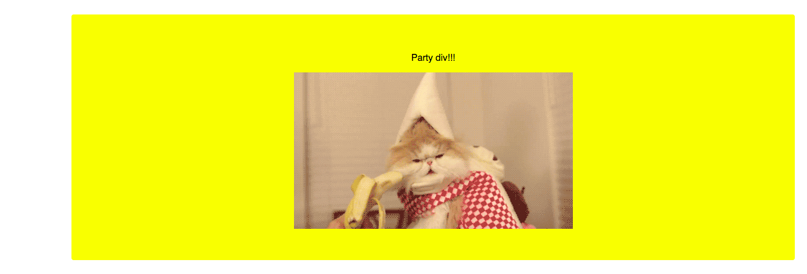

#  CSS Animation (90 mins)

| Timing | Type | Topic |
| --- | --- | --- |
| 15 mins | [Introduction](#introduction) | CSS Animations |
| 20 mins | [Independent Practice](#ind-practice-research) | Research Transforms, Transitions, and Animations |
| 50 min | [Independent Practice](#ind-practice) | Animate it! |
| 5 min | [Conclusion](#conclusion) | Animate it! |

### LEARNING OBJECTIVES
- Utilize browser compatibility techniques such as vendor prefixes, the SHIV, and meta tags.
- Describe the importance of prefixing CSS properties.
- Use properties such as transition and transform to change element properties.
- List the types of properties that can/can't be animated.
- Describe the purpose and syntax of css keyframes.
- List and describe the purpose of the animation properties.
- Compare and contrast using CSS and JS for animations.

***

<a name="introduction"></a>
## Introduction: CSS Animations (15 mins)

Today we'll cover three major topics, each somewhat related:

- CSS Transforms (2D).
- CSS Transitions.
- CSS Animations.

### Vocabulary

**Transforms** are a set of CSS properties that take an element and transform its shape (e.g., rotating it, scaling it, skewing it, etc.).

**Transitions** let us tell the browser how to change a property over time. For example, if the height of an element changes (due to a :hover selector, for example), we can tell the browser to change the height gradually over one second.

**Animations** are similar to transitions, in that they make properties change over time, but they give us more control over how those changes happen. For example, we have more control over how the animation repeats, or changes between multiple values at once, etc.

**Prefixing** If you're using Chrome, you won't need to prefix any properties for this lesson; but in general, it's a good idea to check [Can I Use](http://caniuse.com/) to see if you need to use prefixes to support most users. For CSS animations, you should use prefixes to ensure support for Safari, IE, and other browsers.

The easiest way to do this is with [prefix free](http://leaverou.github.io/prefixfree/).

### Transition Demo
Let's look at an example of what's possible with Transitions!

Look over the following HTML and CSS, which renders as shown in the mockup below. That is one crazy cat:

```html
<body>
  <div class="party">
    <p>Party div!!!</p>
    
  </div>
</body>
```

```css
body {
  margin: 0;
  font-family: 'Open Sans', sans-serif;
  text-align: center;
  padding: 30px;
}

div {
  border: none;
  outline: none;
  background-color: #F78FA7;
  padding: 50px 20px;
  border-radius: 4px;
  margin-left: 0;
}
```

# 

We know what we want the page to look like when the user hovers, so we can code that accordingly using the `hover` psuedo-class.

```css
div:hover {
  background-color: yellow;
  margin-left: 100px;
}
```

# 

#### So where do we apply the `transition` CSS?
The key is to add it to `div` and not `div:hover`. That might seem counterintuitive: Don't we want the animation to happen when the user hovers? We do, but let's break down the order of events:

1. Our `<div>` is styled with the `div{ }` rule.
2. The user hovers on `<div>`.
3. `div:hover{}` styles are applied.

 We can't put `transition` on `div:hover` because, when those styles are applied, the hover has *already happened*. We put the animation styles in the non-hover state of the object to *prepare* for a hover. Here is the complete CSS for the `div`:

  ```css
  div {
    border: none;
    outline: none;
    background-color: #F78FA7;
    padding: 50px 20px;
    border-radius: 4px;
    margin-left: 0;
    transition: all 2s ease-in-out;
  }

  div:hover {
    background-color: yellow;
    margin-left: 100px;
  }
  ```

In the declaration `transition: all 2s ease-in-out;` we have the following values:
- `all` means we want a transition applied to all shared properties of `div{ }` and `div:hover{ }`.
- `2s` is the total time, in seconds, it takes for the animation to occur (this can be a decimal).
- `ease-in-out` is the animation style – this means the transition will happen when the user hovers on the `div` and hovers away from the `div`.

Feel free to explore the code on your own [here](transition-example).

***

<a name="ind-practice-research"></a>
## Independent Practice: Research Transforms, Transitions, and Animations (20 mins)
Break into groups of four. Each group will have 20 minutes to prepare a short explanation/demo of their assigned topic. Your demos should take no longer than five minutes.

| Group | Topic
| --- | --- |
| 1 | [CSS Transforms (No animation)](https://developer.mozilla.org/en-US/docs/Web/CSS/transform) |
| 2 | [CSS Transitions](https://developer.mozilla.org/en-US/docs/Web/CSS/transition) |
| 3 | [CSS Animations (basic keyframes and syntax)](https://developer.mozilla.org/en-US/docs/Web/CSS/@keyframes) |
| 4 | [CSS Animations (timing functions)](https://developer.mozilla.org/en-US/docs/Web/CSS/animation-timing-function) |
| 5 | [CSS Animations (iterations / repeats / direction )](https://developer.mozilla.org/en-US/docs/Web/CSS/animation-iteration-count) |

***

<a name="ind-practice"></a>
## Independent Practice: Animate It! (50 minutes)
Implement as many of the following exercises as you can in the time allotted. Feel free to work with a partner!
- [Loader Animation](independent-practice/loader-animation/starter-code)
- [Spinning Wheel Animation](independent-practice/spinning-wheel-animation/starter-code)
- [Transition Button Animation](independent-practice/transition-button-animation/starter-code)


### Bonus
- [CSS Accordion](independent-practice/accordian-animation)
- [Clock](independent-practice/clock-animation)

***

<a name="conclusion"></a>
## Conclusion (5 mins)
#### CSS vs. JS Animations
CSS Animations are easy and mostly compatible, so they're often a good choice for basic animation needs. For anything more complex, such as animation that depends on user input, you'll need to use Javascript. There are good libraries for animation, including jQuery UI and [GSAP (Greensock Animation Platform)](http://greensock.com/gsap).

***

### Hungry for More?
#### Exercises
- [CSS Ghost](exercises/css-ghost)
- [Solar System in CSS](http://neography.com/experiment/circles/solarsystem/)
  - [*solution*](http://neography.com/journal/our-solar-system-in-css3/)


#### Videos
- [CSS Animation](https://www.youtube.com/watch?v=9RfHG3K8U_Q&index=31&list=PLdnONIhPScST0Vy4LrIZiYKpFNoxgyH7J)
- [CSS Transitions](https://www.youtube.com/watch?v=Xu3SrQhtBqw&index=30&list=PLdnONIhPScST0Vy4LrIZiYKpFNoxgyH7J)
- [CSS Transform](https://www.youtube.com/watch?v=Gu-HBBZLyjg&index=29&list=PLdnONIhPScST0Vy4LrIZiYKpFNoxgyH7J)
