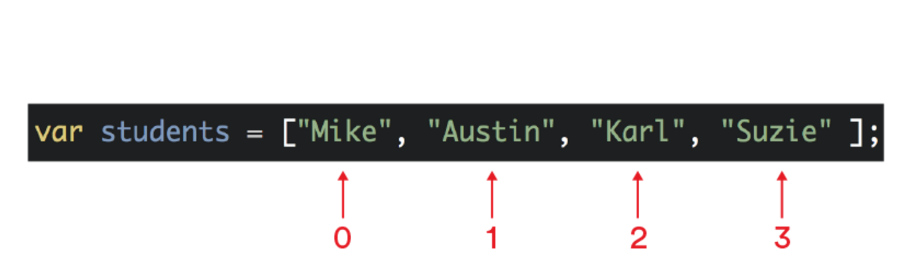

#  Arrays and Loops (90 mins)

| Timing | Type | Topic |
| --- | --- | --- |
| 5 min | [Opening](#opening) | Intro Video |
| 10 min | [Intro to New Material](#arrays-intro) | Intro to Arrays |
| 10 min | [Guided Practice](#updating-arrays) | Updating Arrays |
| 15 min | [Guided Practice](#arrays-deep-dive) | Arrays Deep Dive |
| 25 min | [Independent Practice](#other-arrays-helpers) | Other Arrays Helpers |
| 35 min | [Intro to New Material](#Loops) | Loops |
| 15 min | [Independent Practice](#fizz-buzz) | Fizz Buzz |
| 5 min | [Conclusion](#conclusion) |Review and Q&A |

### LEARNING OBJECTIVES
*After this lesson, you will be able to:*

- Explain the advantages of using arrays.
- Manipulate values in an array.
- Use for loops to iterate through elements in an array.
- Use array helper methods to update an array.
- Differentiate between while loops, for loops, and forEach loops.

### STUDENT PRE-WORK
*Before this lesson, you should already be able to:*

- Create variables in JavaScript.
- Differentiate between data types (strings, numbers, Booleans).
- Use `if/else if/else` conditionals to control program flow based on Boolean conditions.
- Use a text editor.


<a name="opening"></a>
## Opening (5 mins)

So far we've learned about three types of data: strings, Booleans, and conditionals.

In this lesson, we'll take a look at how we can utilize arrays to start to create more complex data structures in JS.

What are arrays? Watch this [intro video](https://generalassembly.wistia.com/medias/upd8qxyabg) for an overview.

---
<a name="arrays-intro"></a>
## Intro to Arrays (10 mins)

As you learned in the intro video, variables cannot hold multiple values.

Unfortunately, strings and numbers are not enough for most programming purposes.

What is needed are collections of data that we can use efficiently &mdash; **arrays**.

With arrays, we can store multiple values in an ordered list. The items on the list — known as **elements** — are separated by commas and situated between brackets `[ ]`.


Arrays are data structures, similar in concept to lists. For example:

``` js
var animals = ["cat", "dog", "cow", "chicken"];
var age = [24, 11, 55];
```

They usually contain the same kind of data, and, in JavaScript, they can dynamically grow and shrink in size.

Arrays can also contain different types of data, such as:

``` js
var stuff = ["red", 42, "gorilla", false];
```

However, we generally use arrays to deal with elements of the same data type.


Arrays help us make the most out of our elements, allowing us to:

- Reorder elements.
- Identify the value of one element in the list by specifying its position.
- Go through the list item-by-item and manipulate each element.

#### Working with Arrays

Take a look at this [video](https://generalassembly.wistia.com/medias/uey023vfx6) that provides an overview of how we can work with arrays.

Before we dive deeper into arrays, let's learn a little about **indexes**.

Items in an array are stored in sequential order. Each element has an **index**, a number that tells us the position in the array where the element can be found.

Indexes allow you to access and update array values.

Take a look at this grocery list. Do you notice anything interesting about how these items are numbered?


You may have noted that the numbers start at 0 instead of 1.

JavaScript, like many programming languages, is _zero-based_, meaning that its numbering starts at 0 instead of 1.

So when we start assigning index values to an array, the first position in the array will be `0`, the second will be `1`, and so on.





> Exercise: Open the console in Chrome and do the following:
>
1. Declare a variable called `villains` and assign it an array with the following strings: `"Cruella"`, `"Ursula"`, `"Jafar"`, and `"Captain Hook"`.
2. Don't forget single or double quotation marks around your strings and a semicolon at the end of your array.
3. Now type `villains;` into the console and press "enter."

Does your array look like this?


```js
var villains = ["Cruella", "Ursula", "Jafar", "Captain Hook"];
```
<br>

> Check: Now, which villain is at index `3`?

<br>

Answer: Because the index starts at `0`, index `3` is `"Captain Hook"`.

<br>


> Note: An alternate way to declare arrays is by using the JS keyword `new`.
```javascript
var a = new Array();
=> undefined
```

Keep your console open; we will continue working with the `villains` array throughout the lesson.


---
<a name="updating-arrays"></a>
## Guided Practice: Accessing and updating elements in an array (10 mins)

#### Getting data from an array

To access, or retrieve, a value from an array, we will use the array name, followed by the index number, wrapped in square brackets.

Let's take a look at some examples.

```js
var colors = ["Red", "Orange", "Yellow", "Green"];

colors[0];
// => "Red"

colors[3];
// => "Green"

```


> Bonus: Can you come up with a way of asking for a random index (whole number) between zero and the length of your array? Hint: `Math.random` and `Math.floor`

#### Updating a value in an array

To update the value of an element in an array, specify the index number of the position where the updated value should be added.

```js
var colors = ["Red", "Orange", "Yellow", "Green"];

colors[0] = "Blue"; // Update the value at index 0
```

Here we are replacing`"Red"` with `"Blue"`. The `colors` array now looks like this:

```js
["Blue", "Orange", "Yellow", "Green"]
```

#### Exercise:

Let's continue working with the `villains` array.

Type `villains;` into the console to see what the array currently looks like.

The console should return:

```js
["Cruella", "Ursula", "Jafar", "Captain Hook"]
```

All right! Now complete the following exercise in your console:


1.  Replace `"Ursula"` with `"Scar"`, using the correct index number (remember indexes start at 0 in JS).

	_Note: the console returns `"Scar"` because that is the newest value that was added to the array._
	
2.  Replace `"Captain Hook"` with `"Maleficent"`.

3.  Now, type `villains` and press enter. Does your console look like this?


```js
var villains = ["Cruella", "Scar", "Jafar", "Maleficent"];

```


---
<a name="arrays-deep-dive"></a>
## Array Deep Dive (10 mins)

#### Length method

Now let's look at the length property. All arrays have a property called `length`, which tells you how many elements the array contains.

To access this value, simply tack on a `.` and `length` to the end of the name of an array (or, alternatively, a variable containing that array). Here are some examples of `length` in action:

``` js
['a', 'b', 'c'].length;  // Evaluates to 3

var x = [10, 20, 30, 40];
x.length; // Evaluates to 4
```


One helpful part of knowing the length of an array is that it allows us to easily find the last (or second-to-last, or third-to-last, etc.) element.

Because the first element in an array always has an index of `0`, the index of the last element will be equal to the length of the array minus one.

``` js
var team = ['ted', 'lem', 'phil', 'linda', 'veronica'];
team[team.length - 1];   // Evaluates to 'veronica'.
team[team.length - 2];   // Evaluates to 'linda'.
```

#### Exercise:

Let's continue working with our `villains` array.

Type `villains;` into the console to see what the array currently holds. You should see the following:

```js
["Cruella", "Scar", "Jafar", "Maleficent"]
```

Complete the following steps in the console:


0.  Use the `length` property to find out how many items are in your `villains` array.
0. Did your console return the value 4? (We listed four villains in total, therefore our array length is 4).
0. Now access the last item in the array using the `length` property.


#### Array helper methods
In addition to containing multiple elements, arrays also have a number of other built-in methods that give them useful abilities. These are called _array helper methods_.

Let's take a look at some of them:

- `push()`
- `pop()`
- `reverse()`
- `join()`


#### ***push()***

The `push()` method allows you to add one or more items to the end of an array.

Note: This means the length of that array will also change.


#### Exercise:

In your console:

1.  Create an empty array of foods: `var favoriteFoods = [];`.
2.  Use the `push()` method to add the item "cheese": `favoriteFoods.push('cheese');`.

	_Note: the console returns the new length of the array &mdash; `1`._
	
3.  Now add multiple new items at once: `favoriteFoods.push('pizza', 'rice', 'taco');`.
4.  Type `favoriteFoods` and hit "enter" to see your final array. Does your array look like this?

```js
[ 'cheese', 'pizza', 'rice', 'taco']
```

#### ***pop()***

The `pop()` method is useful when you want to remove the last item in an array.

Try typing the following into your console:

```js
favoriteFoods.pop();
```

Using this method, the array will now contain this:

```js
[ 'cheese', 'pizza', 'rice' ]
```

What do you think will happen when you call `pop()` on an empty array?

***reverse()***

You can reverse the order of elements in an array with the `reverse()` method.

Try typing the following into your console:

```js
favoriteFoods.reverse()
=> [ 'rice', 'pizza', 'cheese']
```

***join()***

The `join()` method joins all elements of an array into a single string.
The `join()` method accepts an optional argument (the separator), which becomes a string that separates the array values.

Here is how we would use `join()` to combine all elements of an array into a single string separated by a space:

```js
favoriteFoods.join(' ')
=> 'rice pizza cheese'
```

If no argument is supplied to `join()`, the separator defaults to a comma.

```js

favoriteFoods.join()
=> 'rice,pizza,cheese'
```

<a name="other-arrays-helpers"></a>
## Independent Practice: Other Array Helper Methods (10 min)
These are just a handful of the methods available to us.

Let's do a quick mini-lab! Break up into groups of two or three. Each group will have five minutes to research one of these methods and then share with the class what that method does and how to use it.

> Instructor note: Divide methods between groups so each method is covered.

- `array.unshift();`
- `array.shift();`
- `array.splice();`
- `array.slice();`
- `array.concat();`
- `array.sort();`
- `array.toString();`
- `array.reduce();`
- `array.map();`

Explore the the [full documentation for array methods](https://developer.mozilla.org/en-US/docs/Web/JavaScript/Reference/Global_Objects/Array) for other helper methods.


#### Summary for each method:

- `array.unshift();` 
	- Adds one or more elements to the front of an array and returns the new length of the array.
- `array.shift();` 
	- Removes the first element from an array and returns that element.
- `array.splice();` 
	- Adds and/or removes elements from an array.
- `array.slice();`        
	- Extracts a section of an array and returns a new array.
- `array.concat();`       
	- Returns a new array comprised of this array joined with another array
- `array.sort();`         
	- Sorts the elements of an array in place and returns the array.
- `array.toString();`     
	- Converts an array into a string.
- `array.reduce();`       
	- Reduce the array to a single value using the provided callback.
- `array.map();`          
	- Map each value in the array to a new value using the provided callback.


Remember, though, you'll never remember _every_ method. The important thing is to know what methods are available to you and where you can find information on each one when you need it.

---
<a name="loops"></a>
## Loops (5 mins)

#### Loops Intro
What are loops and why are they useful? Take a look at this short [video](https://generalassembly.wistia.com/medias/p2hvzbq53x) to find out!

In the past few lessons, we've only been able to operate on one value at a time. For example:

_If_ a bank has more than $20, allow a withdrawal. _Else_ show an error message.

Now we're going to learn about collections and loops and why they're useful.

#### Iterating over a Collection
**Collections** are groups of values. An example of a collection is an array. One of the most useful things about collections (and arrays in particular) is that, if we structure our code correctly, we can repeat the same operation on each value within a collection.

This process of doing something over and over and over again in a loop, for each element in a set, is called **iteration**.

To tell your program to repeat something, you use a tool called a **loop**. Loops work just like you might imagine: Once your program has finished running a block of code, it 'loops' back to the beginning and starts again.

Remember our `if` statement from the previous lesson? Let's loop it back on itself.


All we have to do is make one small (but very important) change: instead of advancing to the next bit of code after executing the block, we loop back to our condition.


---
#### While Loop (10 mins)
Now, we have a loop — so long as our condition remains `true` (or at least truthy), we will continue to run that block of code over and over again. This type of loop is called a **while loop**, and it can be found in nearly every programming language.


The general rule for writing a **while loop** in JavaScript is:

```js
while (someConditionIsTrue) {
  //A block of code.
}

```

As you can see, it's written in almost exactly the same way as an `if` statement.

Let's look at an example. If `x = 10` and we're subtracting 2 each time we go through the loop, how many times will this loop run?


```js
var x = 10;
while (x > 5) {
  x -= 2;
}
```

If you guessed three times, you're right! The final value of `x` will be 4. Remember, you can use `console.log(x)` to find this answer in the console.


Let's look at another example. How many times will this loop run?

```js
var x = 10;
var y = 1;
while (x < 20) {
  y += 1;
}
```

The loop would run **indefinitely**. Since `x` is defined as 10 and `x` is less than 20, the computer will run it forever because it is always true (_and it will most likely cause your computer to freeze!_).


When using a `while` loop, it's **very important** to plan out beforehand how you will 'escape' the loop by making your condition evaluate to false.

##### Test Yourself
Take a look at the following example:


> Questions to consider:
>
> * How many times does this loop run?
> * What's the final value of myString?

##### Answer


So each time we use `z += 1`, we increase the value of `z` so that eventually our condition, `z < 5`, will be false. If we increase `z` by one each time, there is no way that `z` will always be less than 5! This is our **"escape plan"** for this 'while' loop.

What's most interesting about this kind of setup is that, if we changed that condition from `z < 5` to `z < 10`, or `z < 100`, the loop would change to run exactly 10 or exactly 100 times, respectively.

Basically, we've changed the `while` loop so that it always runs for a fixed, controllable number of times — ensuring that it will never get stuck in an infinite loop.


---
#### For Loop (10 mins)
This kind of setup is so useful, and gets used so frequently, that most languages include a special kind of loop used for just this kind of behavior, called a `for` loop.

These `for` loops are very useful when we want to use a loop to do something with each item in an array. Watch this short [video](https://generalassembly.wistia.com/medias/gguspr8ong) to find out what that would look like.


Despite being one of the most basic ways to iterate through an array in JavaScript (and many other languages), the `for` loop is also one of the most versatile ones!

Let's make a few modifications to our `while` loop from earlier. As you can see, there are a couple of key ingredients to making our `for` loop work.


Let's break down what we'll need:

1. An 'initialization', which sets up a starting situation (e.g., `var i = 0`).
2. A condition, which gets evaluated each time we're about to execute the block (e.g., `i < 10`).
3. A 'finalExpression', which gets evaluated immediately after the block executes _but before the condition is evaluated again_ (e.g., `i += 1`).


The general syntax for a `for` loop is:

```js
for (initialization; condition; finalExpression) {
  // A block of code.
}

```

For example:

```js
for (var i = 0; i < 10; i += 1) {
  // do something 10 times.
}
```

---
#### Exercise:

Follow the instructions in [exercises/for\_loop\_exercise/main.js](exercises/for_loop_exercise/main.js).

<!--
SAVING FOR FUNDAMENTALS

Look at the code below:

```js
var x = 10;

for (var i = 0; i < x; i += 1) {
  console.log('HELLO');
}
```

Turn and discuss the following questions with a partner:

1. How many times will `HELLO` be printed out in the console?
  * `Hello` will be printed out 10 times.
3. What if we changed the starting value of i to 1 instead of 0? How many times would `HELLO` get printed to the console then?
  * `Hello` will be printed out 9 times.
5. What would happen if we changed the condition from `i < x` to `i <= x?`   
  * `Hello` will be printed out 11 times.
7. What would happen if we changed the final condition from `i += 1` to `i += 2`?
  * `Hello` will be printed out 5 times. Great job!-->

---
#### For Loop vs. While Loop
Let's take a step back and recap what we have learned. What is the difference between `for` loops and `while` loops?

The `while` loop is usually used when you need to repeat something until a given condition is true:

```js
inputInvalid = true;
while (inputInvalid) {
  // ask user for input inputInvalid
  // check valid input;
}
```

On the other hand, the `for` loop is usually used when you need to iterate a given number of times:

```js
for (var i = 0; i < 100; i += 1) {
  //do something 100 times.
}
```

You can learn more about the differences between `for` and `while` loops [here](http://programmers.stackexchange.com/questions/244393/what-are-the-differences-between-a-while-loop-and-a-for-loop).


#### For Loop Example
Let's look at a temperature converter for an example of a `for` loop.


Suppose that we were given an array of starting values to work with &mdash; a group of temperatures in degrees Fahrenheit. Now let's say we want to convert them into another set of values &mdash; temperatures in degrees Celsius &mdash; which would then be stored in a separate array.

```js
var tempsInF = [100, 72, 88, 15, 25, 32];
var tempsInC = [];
```

The formula for converting between Fahrenheit and Celsius temperatures is **C = (F - 32) * 5/9**, where F is the temperature in degrees Fahrenheit and C is the temperature in degrees Celsius.


So how do we go about operating on the elements in `tempsInF`? Well, we could just start at the beginning and work our way through, one value at a time.

```js
tempsInC.push((tempsInF[0] - 32) * (5 / 9));
```

Then, we could run an almost identical command to operate on each element in `tempsInF` and push the converted value onto the `tempsInC` array:


```js
tempsInC.push((tempsInF[1] - 32) * (5 / 9));
tempsInC.push((tempsInF[2] - 32) * (5 / 9));
tempsInC.push((tempsInF[3] - 32) * (5 / 9));
tempsInC.push((tempsInF[4] - 32) * (5 / 9));
tempsInC.push((tempsInF[5] - 32) * (5 / 9));
```

However, this code is extremely repetitive.

Fortunately, there is a tool perfectly suited for this task — our old friend, the `for` loop.

```js
for (var i = 0; i < tempsInF.length; i += 1) {
  tempsInC.push((tempsInF[i] - 32) * (5 / 9));
}
```

---
#### forEach

Another way of iterating over an array that was added with ECMAScript 5 is `forEach()`:


```js
["dog", "cat", "hen"].forEach(function(currentValue, index, array) {
   console.log("I want a ", currentValue);
   console.log(array[index]);
});
```


---
<a name="fizz-buzz"></a>
## Independent Practice: Fizz Buzz (15 mins)

Fizz Buzz is a game about division. Create a program that will iterate through numbers from 1 to 101 and log each number in the console.

- In the loop, every time a number is divisible by **3**, instead of logging the number itself, the word "fizz" should appear.
- If the number is divisible by  **5**, the word "buzz" should be logged.
- If the number is divisible by both **3** and  **5**, then the word "fizzbuzz" should be logged.

Hint: Go read about the [Remainder Operator](https://developer.mozilla.org/en-US/docs/Web/JavaScript/Reference/Operators/Arithmetic_Operators) on MDN and figure out how to use it to simplify this problem.

A typical output in the Chrome Dev Tools would look like this:


#### Solution

```javascript
for (var i = 0; i < 100; i += 1) {

  if ( (i % 3 === 0) && (i % 5 === 0) ) {
    console.log("fizzbuzz");
  } else if (i % 3 === 0) {
    console.log("fizz");
  } else if (i % 5 === 0) {
    console.log("buzz");
  } else {
    console.log(i);
  }
}
```

<a name="conclusion"></a>
## Conclusion (5 mins)
- Review Fizz Buzz Solution.
- Review Learning Objectives.

In this lesson, we've seen how loops can be used to easily repeat a certain set of actions numerous times. You will learn throughout this course how you can utilize loops in order to make your work more efficient and simpler.

For an example of when loops would be useful in a real-life program, watch this [video](https://generalassembly.wistia.com/medias/6feruq1w7b) in which a developer talks about the last time he used a loop.

***


### ADDITIONAL RESOURCES
- Exercises
	- [Robot Booking](exercises/robot_booking.md) (Beginning)
	- [Loops Exercises](exercises/loops_exercises.md) (Beginning to Medium)
	- [Loops Labs](exercises/loops_labs.md) (Beginning to Advanced)

- Videos
	- [Loops Case Study](https://generalassembly.wistia.com/medias/6feruq1w7b)
- Readings
	- [For vs. While Loop](http://programmers.stackexchange.com/questions/244393/what-are-the-differences-between-a-while-loop-and-a-for-loop)
	- Eloquent JavaScript - [Program Structure - Loops](http://eloquentjavascript.net/02_program_structure.html)
	- Eloquent JavaScript - [Data Structures - Arrays](http://eloquentjavascript.net/04_data.html)


> Instructor note: When possible, provide a brief description of Additional Resources, classifying whether they are for advanced or beginner students.  
