#   Control Flow (90 mins)

| Timing | Type | Topic |
| --- | --- | --- |
| 5 min | [Opening](#opening) | Intro |
| 20 min | [Intro to New Material](#comparison-logical) | Comparison and Logical Operators |
| 10 min | [Independent Practice](#true-false) | True or False? |
| 25 min | [Intro to New Material](#intro-operators) | Logical Operators, Truthy and Falsey |
| 30 min | [Intro to New Material](#conditional-statements) | Conditional Statements |
| 10 min | [Independent Practice](#switch-statements) | Switch Statements |
| 15 min | [Guided Practice](#ternary-statements) | Ternary Statements |
| 5 min | [Conclusion](#conclusion) |Q & A |

### LEARNING OBJECTIVES
*After this lesson, you will be able to:*

- Differentiate between `true,' `false,' 'truthy,' and 'falsey.'
- Use `if`, `else if` and `else` to control program flow based on Boolean conditions.
- Use comparison operators to evaluate and compare statements.
- Use Boolean logic (`!`, `&&`, `||`) to combine and manipulate conditionals.
- Use switch conditionals to control program flow based on explicit conditions.


### STUDENT PRE-WORK
*Before this lesson, you should already be able to:*

- Create variables in JavaScript.
- Differentiate between data types (strings, numbers, Booleans).
- Use a text editor.


---
<a name="opening"></a>
## Opening (5 mins)
- Review current lesson objectives.

What is control flow? Watch this [video](https://generalassembly.wistia.com/medias/zhahjd0c7t) to discover more about the role control flow plays in development.

JavaScript supports a compact set of statements, specifically control flow statements, that you can use to incorporate a great deal of interactivity into your application.

We can make decisions based on the choices the user makes. This will make our applications seem responsive and "smart."

***

<a name="comparison-logical"></a>
## Introduction: Comparison and Logical Operators (20 mins)


#### Intro to Conditions
Comparison and logical operators are useful in JS because they help us compare different conditions to one another.

**Conditions** are usually made up of a mathematical statement that uses an operator (the signs that allow us to make the comparison, such as equals, less than, or greater than).

Conditions are statements that make comparisons that evaluate 'true' or 'false' in order to control the flow of the program.

Take a look:

```js
if (score > 50) {
  console.log("Congrats! You've passed this level.")
}
```

Below, the condition is the comparison within the parentheses:

```js
score > 50
```

#### How Conditions are Used
When information is incorrect, JavaScript can help identify the comparison as false.

So if you're filling out a form that requires your birthday, you can't say you were born in the year 2045 because that year hasn't occurred yet.

You also can't say that you were born on December 45th, because that day doesn't exist.

When you try entering information like this, JS will identify that it is wrong by comparing the information you entered against information it knows to be accurate.

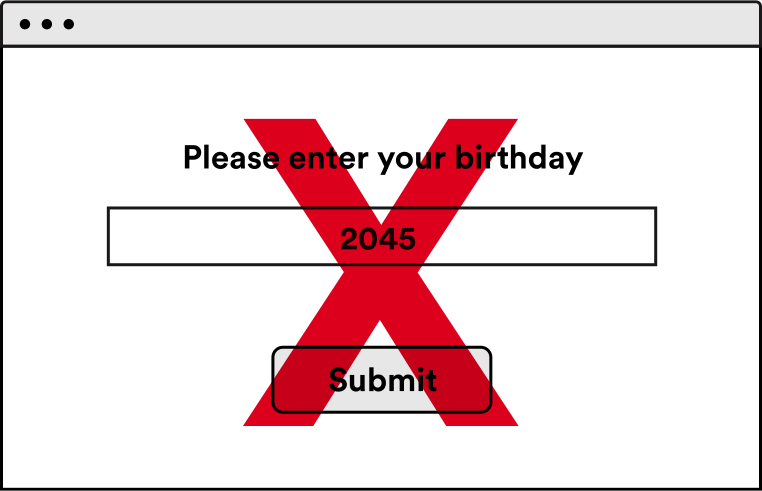

Making comparisons is almost like asking questions about the information the user has entered.

Is the year less than or equal to 2016 and more than or equal to 1900? If the answer to this question is "true," then we know the user has entered a valid year, and that he or she was born sometime between 1900 and 2016.

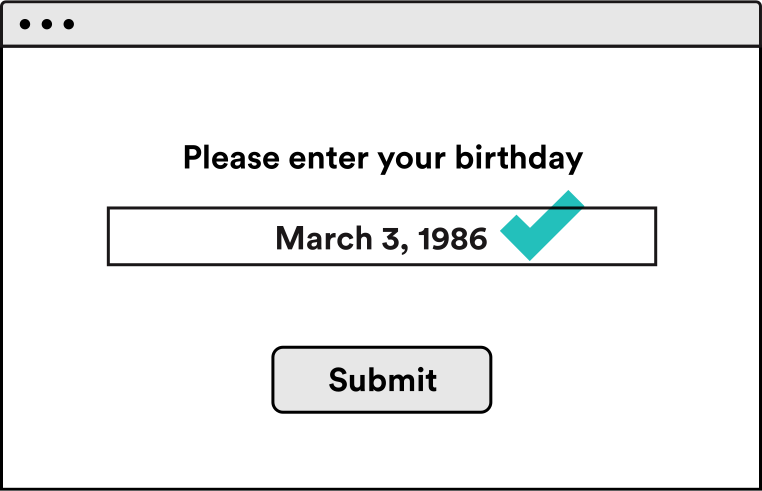

Did you notice how we used the term "less than or equal to" to check, or compare, two things? This is how our comparison operators help us make decisions.

***

Comparison operators are binary in that they compare two values against one another and return a Boolean value: either `true` or `false`.

Comparisons in JavaScript can be made using `<`, `>`, `<=`, and `>=`, and work for both strings and numbers.

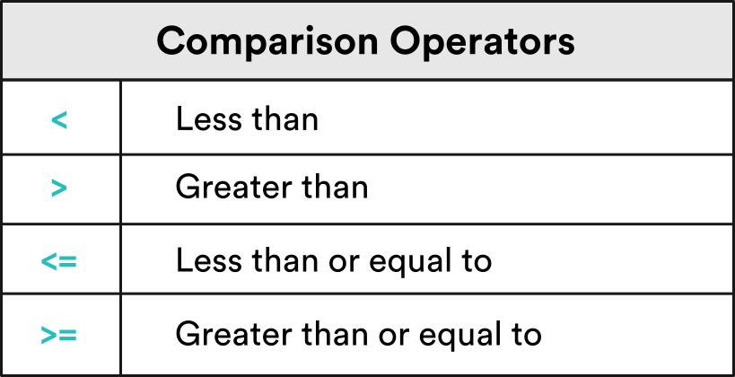

#### Exercise:

Type each command given in the console below. Before you press "enter," take a moment to think about what value the console will return.

1.  `7 > 7`
2.  `7 >=7`
3.  `7 < 7`
4.  `7 < 13`
5.  `7 <= 13`

>_(Answers: 1.The console returns `false`. 2.The console returns `true`. 3.The console returns `false`. 4.The console returns `true`. 5.The console returns `true`.)_


#### Equality Operators

Now let's take a look at equality operators (these can be a bit more complex).

Equality operators check to see whether two values are the same as, or equal to, one another.   

There are two ways to verify equality in JavaScript:

The `==` operator or the `===` operator. In this course, we will always use the `===` operator, because it is more accurate.

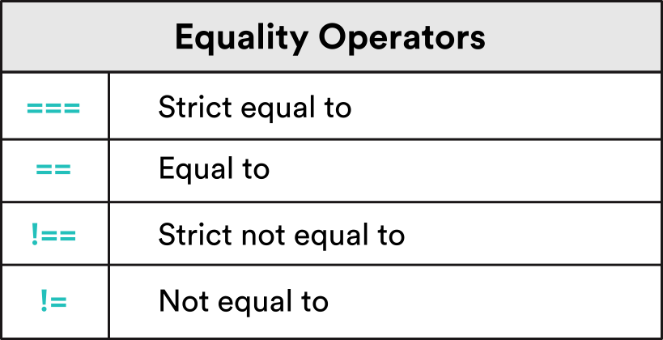

#### `==` Equals Operator

First let's take a look at the `==` operator.

When verifying equality using the double equal (`==`), JavaScript performs something called "type coercion."

Type coercion means that, if the values on both sides of the equality operator have a different type (e.g., the number `1` and the string `"1"`), JavaScript will try to change the type of both operands to check whether or not they are equal.

>_Type each command in the console. Before you press enter, take a moment to think about what value the console will return._

> 7 == 7 <br>
> 7 == "7"


>Note that the second statement evaluates to true, even though we are comparing a number and a string.

#### Type coercion

So why is that?

This is because, behind the scenes, JavaScript is trying to convert the values before comparing them.

```
7 == 7    //=> true
7 == "7"  //=> true
```

Here, the interpreter (a.k.a., the console) would first try to convert `7` to a string (`"7"`) and then compare `"7"` with `"7"`.

Because those values are equal, this would return `true`.

Because JS tries to change an expression so that both types are equal, it's easier for expressions to return true. If we're not careful, this can cause some unexpected (and unwelcome) behavior.

#### The Strict Equals Operator `===`

To avoid type coercion and ensure stricter comparisons, use the triple equals operator, also known as the strict equality operator (`===`).

The `===` operator checks to make sure the type and the value on both sides of the `===` are the same.


Now let's take a closer look at the answers:

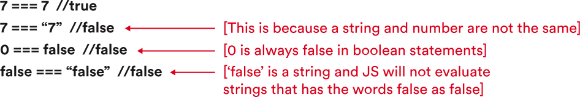

The double equals signs (`==`) can be useful when both the type and value are the same; but because their type coercion could potentially derail your program, they're best avoided when you're just getting started out.

By sticking to the `===` operator, we can ensure that we are checking both the type and the value.

#### The Not Equals Operator `!==` and `!=`
What do we do if we want to check and see if two values are not equal to one another?

We use the inequality operators (`!=` and `!==`).

The `!=` operator checks to see if two values are not equal to one another. Similar to the `==` operator, it performs type coercion before checking the two values against one another.

The `!==` compares two values to one another without performing type coercion, so both the values and the types are compared.

<a name="true-false"></a>
## Independent Practice: True or False? (5 min)

Type each command in the console. Before you press enter, take a moment to think about what value the console will return. Answers are found below.

1.  `7 === 7`
2.  `7 === "7"`
3.  `0 === false`
4.  `false === "false"`
5.  `7 !== 7`
6.  `7 !== "7"`
7.  `0 !== false`
8.  `false !== "false"`

_(1.The console returns `true`. 2.The console returns `false`.  3.The console returns `false`. 4.The console returns `false`. 5.The console returns `false`. 6.The console returns `true`. 7.The console returns `true`. 8.The console returns `true`.
)_

***
<a name="intro-negation"</a>
## Truthy, Falsey, and Double Negation (15 mins)
Everything in JavaScript — from the strings we learned about in Unit 1 to the `null` and `undefined` values we just covered — has an inherent Boolean value that can be thought of as being either _truthy_ or _falsey_.

But what does it mean to say that, for example, `"apple"` is _truthy_? After all, `"apple" !== true`. An apple can never be equal to an orange!

`"apple"` is not literally `true`, but the JavaScript langauge considers it to be _truthy_.

We can prove this by "double negating" a value in JavaScript, to force (or "coerce") it into its Boolean value.

``` js
true //=> true
!true //=> false
!!true //=> true
// Therefore true is truthy!

"apple" //=> "apple"
!"apple" //=> false
!!"apple" //=> true
// therefore "apple" is truthy!
```

Try it out! Using double negation, can you find all 6 _falsey_ values in JavaScript (_spoilers below_)?

Jumping ahead a little, another way to determine whether a value is truthy or falsey is to use a conditional:

``` js
var val = "apple"; // Try a bunch of different values!
if (val) {
    console.log(val, "is truthy!");
} else {
    console.log(val, "is falsey!");
}
```

#### Truthy
Something is _truthy_ when it can be coerced into the Boolean value `true`. In JavaScript, _truthy_ values include:

- `"abc"` (any non-empty string)
- `-1`, `1`, `2.5` (any non-zero number)
- `true`

#### Falsey
Something is _falsey_ when it can be coerced into the Boolean value `false`. The _falsey_ category of values includes:

- `false`
- `0` (zero)
- `""` (empty string)
- `null`
- `undefined`
- `NaN` (a special Number value meaning "Not a Number"!)


#### Summary
Below are the exact rules that Boolean operators follow when dealing with non-Boolean input values.

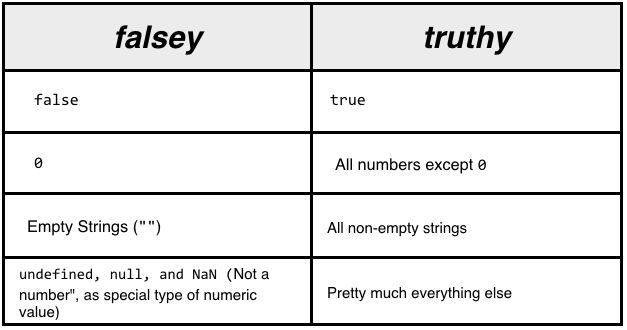

The best way to determine if something is _truthy_ is to determine that it’s not _falsey_.

As you saw in the table, there are six falsey values in JS (memorize them!):

`undefined`, `null`, `NaN`, `0`, `""` (empty string), and `false`, of course.
<br>
<br>

### The Logical Operators AND and OR
In addition to NOT, the logical operators OR (`||`) and AND (`&&`) give us the ability to control the flow of our programs. But first we have to understand some of their odd quirks.

The Boolean operators `!`, `||`, and `&&` follow a set of rules that determine how they behave:

- NOT(`!`): If the value is truthy, return `false`; if the value is falsey, return `true`.
- OR (`||`): Return the first truthy value; if both values are falsey, return the last falsey value. OR is nicknamed the "default operator" (can you explain why?).
- AND `(&&):` Return the first falsey value; if both values are truthy, return the last truthy value. AND is nicknamed the "guard operator" (can you explain why?).

#### AND
Let’s take a closer look at the "truth table" produced by investigating all possible comparisons of `true` and `false` using AND:

``` js
true && true //=> true
true && false //=> false
false && true //=> false
false && false //=> false
```

> Question: In the above table, what is the only case in which AND evalutes to `true`?

#### OR
Now let’s do the same for all possible combinations of `true` and `false` using OR:

``` js
true || true //=> true
true || false //=> true
false || true //=> true
false || false //=> false
```

> Question: In the above table, what is the only case in which OR evalutes to `false`? How does this compare to the behavior of AND (above)?

#### Beyond `true` and `false`
If you think you have a handle on AND and OR, think again. When we move beyond Boolean values, things start to get a little strange:

``` js
1 && 1 //=> 1
1 && 0 //=> 0
0 && 1 //=> 0
0 && 0 //=> 0
```

Is that what you expected?

``` js
1 || 1 //=> 1
1 || 0 //=> 1
0 || 1 //=> 1
0 || 0 //=> 0
```

What's actually happening under the hood? (HINT: think _truthy_!)

#### AND - The "Guard Operator"
``` js
true && "potato" //=> "potato"
true && true && true && "potato" //=> "potato"
```

What's the "guard operator" guarding? When does AND let you through? When does it stop you?

Exercise:
``` js
1 && "potato" //=> ?
false && "potato" //=> ?
0 && "potato" //=> ?
```

#### OR - The "Default operator"
``` js
false || "kiwi" //=> "kiwi"
false || false || false || "kiwi" //=> "kiwi"
```

What's the "default operator" defaulting to? When does it default? When does it ignore the default?

Exercise:
```js
0 || "kiwi" //=> ?
true || "kiwi" //=> ?
1 || "kiwi" //=> ?
```


### All Together Now: Combining Operators and Comparators
Often we need to combine individual logical statements into larger and larger expressions.

For example, all the following criteria need to be `true` before I will agree to purchase a vintage bicycle:

    make: Schwinn
    model: Collegiate
    year: 1986-1975
    price (max): 125.25

We can translate each of these criteria into code using comparison operators as follows:

```js
make === "Schwinn"
model === "Collegiate"
year < 1985
year >= 1975
price <= 125.25
```

Next we can combine them together using our logical operators:

``` js
make === "Schwinn" && model === "Collegiate" && year < 1985 && year >= 1975 && price <= 125.25
```

But what if I'd also settle for any make/model of bicycle, from any year, if the price was right (which is to say, free)? Is there a way I could incorporate that into my expression in a single line? There sure is!

Price is the most important factor, so let's address that first!

``` js
price === 0 || make === "Schwinn" && model === "Collegiate" && year < 1985 && year >= 1975 && price <= 125.25
```

> `price === 0` is the equivalent of saying `!price`. Can you explain why?

You can definitely squeeze it all into a single line of JavaScript... but we may need some better tools to handle all this complexity!


***
<a name="conditional-statements"></a>
## Intro to New Material: Conditional Statements (30 mins)

Now we're going to learn a bit more about conditional statements and how we can use them to control the flow of a program.

Take a look at this short [video](https://generalassembly.wistia.com/medias/afk2hatfe0) that describes how conditional statements tie in with the material we just covered.

We can use a conditional statement to skip over a block of code if it does not pass a Boolean expression.

Let's say our condition is `7 > 5`.

This is an example of a condition that the interpreter will evaluate as either `true` or `false`.

Once we have this type of condition, we can add in our conditional statements to take one path if the condition is true, and another if the condition is false.

```js
if (condition) {
  // Take this path when the condition is true!
} else {
  // Take the other path when the condition is false!
}
```

#### `if...else` statements

Let's start by looking at `if...else` statements.

As you may have guessed from its name, the first component of the `if...else` statement is the *if statement*.

An *if statement* allows us to check whether or not a condition is true and, if it is, run our code.

The conditional below is an `if` statement.

An `if` statement will take in a condition and, if that condition is truthy, run whatever code you specify.

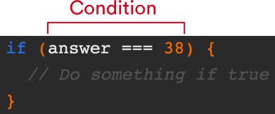

#### Flow Charts
You're probably already familiar with a common real-world application of the `if` statement: the *flow chart*.

A *flow chart* is a visual diagram that tells us how to behave depending on a certain set of conditions.

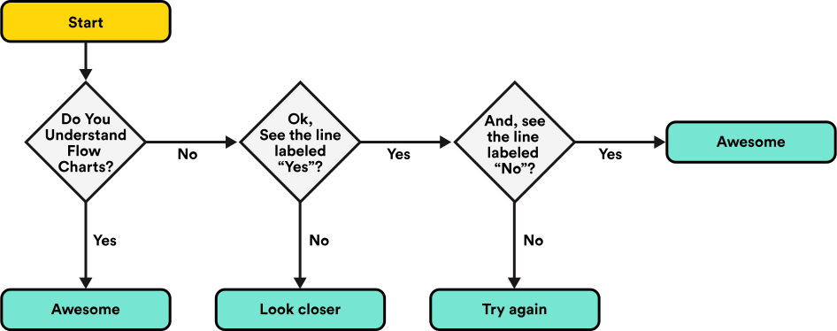

If we were to draw a flowchart to describe the following if statement:


```js
if (x > 10) {
  x += 10;
  y += 10;
}
```

We might come up with something like this:

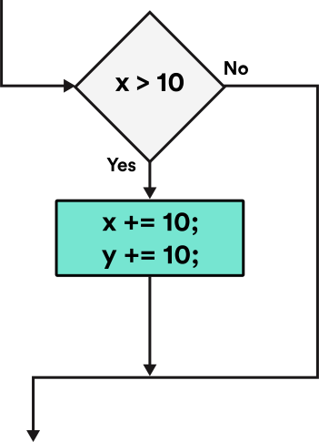

As you can see, a person making their way through this diagram would need to make a decision.

Depending on whether or not our condition is truthy, he or she would either enter the block of code or skip over it entirely.


#### Else If Statements
Adding an `else if` to our `if` statement allows us to specify a second condition to test.

However, this second condition will *only* be tested if the first condition fails.

For example, let's say we want to offer both a senior discount and a student discount for movie tickets:

```js
if (age < 18) {
  console.log("Student discount applied");
} else if (age > 65) {
  console.log("Senior discount applied");
}
```

Notice how we are now able to check to see if multiple conditions are true.

We can add as many `else if` statements as we want. You just keep tacking them on.

These statements allow us to add complex logic to our program, which can check for multiple conditions and specify an action for each result, making our program seem more intuitive and user-friendly.

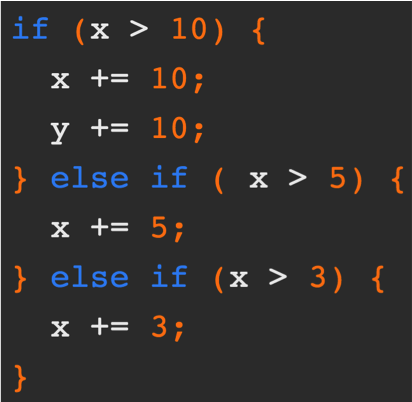

#### Else Statements

At this point, if none of the conditions we check for are true, then nothing will happen.

We need a way to check several conditions, and the ability to move forward if none of these conditions are true; in other words, a default or fallback course of action.

To specify behavior for this outcome, we must add an `else` to the end of our statement.

Let's look at an example of an else statement:

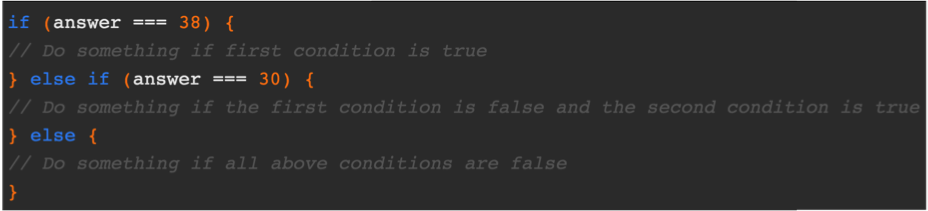


#### Exercise

Imagine you work in the information booth at a theme park and help recommend rides to guests.

If a person is less than 8 years old, recommend the merry-go-round.

Else if a person is more than 8 years old and less than 65 years old and more than 4.5 feet tall, recommend the roller coaster.

Else recommend the lazy river.

Try typing this out in your console.

Sample solution:

```js
var age = 25;
var height = 5;
if (age <= 8) {
  console.log("Check out the Merry-Go-Round. You'll love it!");
} else if (age > 8 && age < 65 && height > 4.5) {
  console.log("Check out the Roller Coaster. It's awesome!");
} else {
  console.log('Why not enjoy a float down the Lazy River?');
}
```

#### Note: Assignment vs. Comparison Operator
Within our conditions, we will often need to check whether or not two values are equal to one another, and perform an action based on the results.

Example:

```js
if (result === true) {
  // Congratulate the user on passing
}
```

Notice that we used a triple equals instead of a single equals in the condition.

This is important to note, as confusing the assignment operator with the comparison operator is a common mistake for beginners.

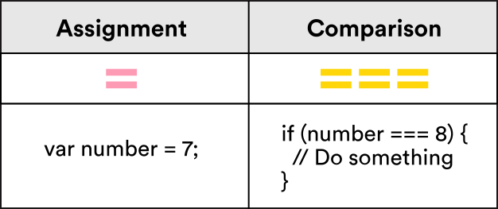

Take a look at the following example:

Here, we are not comparing x with the number 3. We're _assigning_ the variable x the value of 3 by using `=` instead of `===`.

```js
if (x = 3) {
  console.log("boo");
}
```

If we wanted to see if x is equal to 3, we would use a *comparison* operator (the triple equals sign):

```js
if (x === 3) {
  console.log("boo");
}
```

#### Switch Statement
Before we dig into switch statements, watch this short [video](https://generalassembly.wistia.com/medias/sew8suaz5l) providing an overview of how they can help us keep our programs simple and readable.

Now that you're feeling more comfortable with if...else statements, let's go back to the other type of conditional statement we mentioned earlier in this lesson: **switch statements**. We've seen how a person can check numerous conditions by simply tacking on **else if statements**.

```js
if (x > 10) {
	x += 10;
	y += 10;
} else if (x > 5) {
	x += 5;
} else if (x > 3) {
	x += 3;
}
```

Here's a refresher of what the flowchart for this action would look like: 

However, if we have a lot of conditions, the code becomes repetitive and hard to read.

For example:

```js
// day of the week in a number, sunday is 0, saturday is 6
var dayNumber = 1;

if(dayNumber === 0){
	day = 'Sunday';
} else if(dayNumber === 1) {
	day = 'Monday';
} else if(dayNumber === 2) {
	day = 'Tuesday';
} else if(dayNumber === 3) {
	day = 'Wednesday';
} else if(dayNumber === 4) {
	day = 'Thursday';
} else if(dayNumber === 5) {
	day = 'Friday';
} else if(dayNumber === 6) {
	day = 'Saturday';
} else {
	day = null;
	alert('wrong value for day');
}
```


This code is not easy to read, and a lot of it repeats. For one, `} else if(dayNumber === __ ) {` is repeated seven times. What's more, if we ever want to change the name of our `dayNumber` variable, we'll need to swap it out every place it appears.

Enter the `switch statement`. A **switch statement** is used to perform different actions based on different conditions. It is a replacement for if/else statements when our code gets long and nested. Take a look at how the previous example would be written as a switch statement:


```js
var dayNumber = 1;
switch (dayNumber) {
case 0:
  day = 'Sunday';
  break;
case 1:
  day = 'Monday';
  break;
case 2:
  day = 'Tuesday';
  break;
case 3:
  day = 'Wednesday';
  break;
case 4:
  day = 'Thursday';
  break;
case 5:
  day = 'Friday';
  break;
case 6:
  day = 'Saturday';
  break;
default:
  day = null;
  alert('wrong value for day');
}
```

This code works exactly the same as our `if/else` statement, and, even though it contains more lines, it's significantly easier to read.

In a switch statement,

1. The variable in parentheses (in this case, `dayNumber`) is evaluated.
2. If there is a `case` listed for the value it evaluates to, the code between `case __:` and `break` will be executed.
3. If there is no `case` that matches the value of the variable, the `default` will be executed (if it is specified, that is — if not, the program will do nothing).
4. If there is no `break;` at the end of a case, the computer will not skip to the end. Instead, it will start executing the next case's code (even if the case's value is different than the variable's), and will continue doing so until it eventually hits a `break;` statement.
5. For this reason, default never needs a `break;` statement, as it's the last case in the switch. Include breaks on all other statements to make sure the program breaks out of the switch statement once it executes the matched statement.  


#### Advantages and Disadvantages of Switch Statements
The main advantages of switch statements is the **increase in readability** and the **decrease in repetition**, both of which make your code more maintainable.

Although the switch statement has some advantages over `if...else`, it also has some major disadvantages. For instance, a switch statement will only work if you are testing the same variable (or expression) in every condition; if not, the `if...else` is your only option.

Also, depending on the circumstances, using `if...else` might scan more naturally. As a rule, use switch statements when you are working with only one variable, or if you have three or more conditions to check.


<a name="switch-statements"></a>
## Independent Practice: Switch Statements (10 min)

1. Take a look at the following `switch` statement:

```js
switch (2 * x) {
case 2:
  y = 49;
  break;
case 4:
  y = 37;
  break;
case 6:
  y = 25;
  break;
case 8:
  y = 13;
  break;
default:
  y = 1;
}
```


2. Turn to a partner and spend a few minutes discussing the following:

What value will `y` be assigned when `x` is ...

1.   1?
2.  4?
3.   0?
4.  "Hello"?


>_(Answers: 1. 49, 2. 13, 3. 1, 4. 1)_

***
<a name="ternary-statements"></a>
## Guided Practice: Ternary Statements (15 mins)

Great job! Now that we've had a chance to gain some experience with switch statements, let's move on. Another shortcut for a simple JavaScript if...else statement is the **ternary statement**. A ternary statement is a one-line shorthand for an `if...else` statement. Similar to an `if...else` statement, it evaluates a condition and then returns one of two results based on whether the condition is true or false. Take a look at the following `if...else` statement:

```js
var score = 90;
var studentPasses;

if (score > 80) {
  studentPasses = "Student Passes!";
} else {
  studentPasses = "Student Fails.";
}

studentPasses;
//=> "Student Passes!"
```

This code could be shortened to a single line using a ternary statement.  

```js
var score = 90;

var studentPasses = score > 80 ? "Student Passes!" : "Student Fails.";

studentPasses;
//=> "Student Passes!"
```

`condition ? result1 : result2;`

Let's break it down:

1. Whatever the `if` condition is will be used as the condition here. Again, a condition is a statement that evaluates to true or false.  
	- So in the example, the condition would be `score > 80`. The condition is then followed by a question mark (`?`).  
2. `result1` and `result2` are our possible outcomes. If the condition is true, the operator will return the value of `result1`; otherwise it will return the value of `result2`.

Here's a second example:

```js
var weather;
if (temperature > 60) {
  weather = "fair";
} else {
  weather = "poor";
}
```

This could be shortened to the following:

`var weather = temperature > 60 ? "fair" : "poor";`


Although having clean and succinct code is useful, readability is also important. Sometimes ternary statements can be harder to scan and understand than a simple `if...else` statement. So if you're ever in doubt, remember to choose readability over less code. Let's give it a try! Take this `if...else` statement and turn it into a ternary statement:

```js
var day = "Monday";
var goToWork;

if (day === "Saturday" || day === "Sunday") {
	goToWork = "It's the weekend!";
} else {
	goToWork = "Go to work!";
}

goToWork;
// => "Go to work!"
```

Try practicing writing this code out as a ternary statement.

Answer:

```javascript
var day = "Monday";

var goToWork = day === "Saturday" || day === "Sunday" ? "It's the weekend!" : "Go to work!";

goToWork;
// => "Go to work!"
```


#### Independent Practice - Turn and Talk

Let's Practice!


```javascript
var goToWork = day === "Saturday" || day === "Sunday" ? "It's the weekend!" : "Go to work!";

goToWork;
// => "Go to work!"
```

What will the value of `goToWork` be under the following circumstances? Discuss with a partner.

1.  `var day = "Wednesday"`
2.  `var day = "Saturday"`
3.  `var day = "Friday"`

>_(Answers: 1. "Go to work!", 2. "It's the weekend!", 3. "Go to work!")_


## Independent Practice (15 mins)

Follow the instructions in [exercises/cash\_register.md](exercises/cash_register.md).


***

<a name="conclusion"></a>
## Conclusion (5 mins)

Let's turn to a summary of conditionals and test ourselves with a short quiz.

Using `if...else` statements allows us to write code that can behave very differently in different circumstances.

Consider the following conditional statement:

```js
if (x > 5) {
  y = 50;
} else if (x < 5) {
  y = 33;
} else {
  y = 100;
}
```

- What value will be assigned to y if x is 10?
  <!-- Answer: 50 -->
- What value will be assigned to y if x is 4?
  <!-- Answer: 33 -->
- Under what circumstances will y be assigned a value of 100?
  <!-- Answer: x=5 -->


You'll probably need to refresh yourself on the exact syntax a few times before you memorize it, but it's important to be able to remember these core "control flow" concepts in general, as they'll come up in pretty much every programming language you'll ever encounter.

We also looked at how we can keep our code readable and concise by using switch statements.

Often, developers will write code to get things up and running first, and then look back over the code to see how it could be streamlined. Switch statements are excellent tools for doing just that!

***


### ADDITIONAL RESOURCES
- Exercises
	- [Switch Statement Exercise](exercises/switch_statement_practice.md) (Beginner with Medium Difficulty questions)
	- [Booleans and Comparison Operators](exercises/booleans_comparison_operators.md) (Beginner)
	- [Control Flow Exercises](exercises/control_flow.md) (Beg - Adv)
	- [Choose your Own Adventure](exercises/choose_adventure.md) (Medium)
- Readings
	- [Eloquent JavaScript - Program Structure](http://eloquentjavascript.net/02_program_structure.html)
	- [Control Flow MDN](https://developer.mozilla.org/en-US/docs/Web/JavaScript/Guide/Control_flow_and_error_handling)
- Videos
	- [Switch Statements](https://generalassembly.wistia.com/medias/sew8suaz5l)
	- [Control Flow Case Study](https://generalassembly.wistia.com/medias/zhahjd0c7t)


> Instructor Note: When possible, provide a brief description of Additional Resources, classifying whether they are for advanced or beginner students.  
