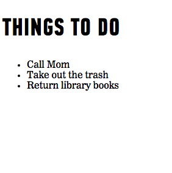

#  DOM Manipulation (90 mins)


| Timing | Type | Topic |
| --- | --- | --- |
| 5 min | [Opening](#opening) | DOM Intro Video |
| 10 min | [Intro to New Material](#intro-dom) | Intro to the DOM |
| 5 min | [Intro to New Material](#accessing-elements) | Accessing Elements |
| 10 min | [Guided Practice](#selecting-elements) | Selecting Individual Elements |
| 10 min | [Guided Practice](#selecting-multiple-elements) |Selecting Multiple Elements |
| 10 min | [Intro to New Material](#node-lists) |NodeLists |
| 25 min | [Guided Practice](#manipulating-the-dom) |Manipulating the DOM |
| 10 min | [Intro to New Material](#browsers) |How Do Browsers Work? |
| 15 min | [Independent Practice](#independent-practice) | Vanilla JS |
| 5 min | [Conclusion](#conclusion) |Q&A |

### LEARNING OBJECTIVES
*After this lesson, you will be able to:*

- Describe the Document Object Model.
- Understand the difference between markup and the DOM.
- List several Vanilla JS methods.
- Access elements in the DOM using Vanilla JS.
- Add and remove elements using Vanilla JS.
- Edit existing elements in the DOM using Vanilla JS.


### STUDENT PRE-WORK
*Before this lesson, you should already be able to:*

- Create variables in JavaScript.
- Create arrays and access/manipulate elements in arrays.
- Create objects with multiple properties and methods, and add and retrieve properties.

---
<a name="opening"></a>
## Opening (5 mins)

In previous units, we've relied on `console.log` and `alert` to give feedback to users, but these will only get us so far.

In this unit, we'll look at how we can provide more meaningful feedback and make our sites more user-friendly by allowing users to interact with our site and see the contents update in real time.

Before we get too deep into the DOM, let's watch a [video](https://generalassembly.wistia.com/medias/pg282hmlha) to better understand how it works in the browser.

***

<a name="dom-intro"></a>
## Intro to the DOM (10 mins)

Let's walk through some of the primary aspects of the DOM.


1) The DOM allows you to find elements.

- JavaScript exposes the DOM of browser pages as an object that we can access called "document."

- This allows us to search through and access elements on the page such as links, images, paragraphs, etc.

2) The DOM allows you to _get_ content.

- The DOM makes it easy to access content within a page, especially when we want to find out what information a user has entered into a form field.

- The answers could include email addresses, first and last names, and more.


3) The DOM allows us to _set_ content.

- The DOM also allows us to dynamically update the content of the HTML elements on our page.

- Maybe we want to change the text of the h1 to read "JavaScript Ninja's Website," or maybe we want to update the src attribute of an image when the user clicks a "next" button. We can dynamically update any of the HTML, text content, or attributes for the elements on our page.

4) The DOM allows you to add animations and effects.

- This is where things start to get fun! Maybe we want a dropdown menu to slide down when a user clicks on an icon. Or maybe we want a "Success!" message to fade in when our user submits a form.

- Perhaps we want different images to fade in and out as a user scrolls down the page. All of this is possible with JavaScript!


5) The DOM allows you to create **event listeners**.

- We will learn more about event listeners in a future lesson. Basically, we don't always want the final state of our page to be the same as its initial state.

- JavaScript allows us to react to the user's actions by having the DOM "listen" or "wait" for a user to take an action (trigger an event) before we run a block of code.

To review, the DOM allows us to:


#### The DOM and the browser
As we've seen, the browser pulls in these HTML documents, parses them, and creates object models of the pages in its memory.

This model is the **Document Object Model (DOM)**.

The DOM is structured like a tree, which we (unsurprisingly) call the **DOM Tree**.

Each element in the HTML document is represented by a **DOM node**.


You can think of a node as a live object you can access and change using JavaScript.

When the model is updated, those changes are reflected on the screen.


> Note: You may sometimes hear developers use the terms "node" and "element" interchangeably.

> They often say things like, "Let's select an element to work with," instead of, "Let's select a node to work with."


#### Example

Here's how the DOM Tree structure works within the web page for a simple to-do list:


1. Perhaps we want to add a class or update styling to change the background color of an element.
- The DOM allows us to get and set attributes for these nodes.

2. In our to-do list, we can access and change content. For example, if we wanted to change the text in the third `<li>` to read "Return library books — DONE!"
3. We can even add new nodes to the page, or remove ones we no longer want.


#### Summary

So the DOM is a (potentially) large object that describes the structure of our content. Because it's an object, we can use standard techniques to get and set data.

In the browser, the DOM is represented by the `document` object. Luckily, JS specifies some built-in methods that make the DOM easier to us.


#### DOM vs. HTML
#### Inspecting the DOM
It's common for front-end developers to work with the DOM while developing. But how do they do it?

Two words: Developer tools.

Most browsers offer a developer tools feature that allows users to inspect and play with the DOM.

For example, if you are using the Chrome browser, you can right-click anywhere within the site you're viewing and select "Inspect" to open Developer Tools.


Or you can type the following shortcuts:  
**Mac** - Command + Shift + C  
**Windows / Linux** - Ctrl + Shift + C or F12.


#### How is the DOM different from HTML?

When you look at the "elements" panel in Developer Tools, you're seeing the browser's rendered version of HTML &mdash; the DOM.

It should look similar to your normal HTML, but it isn't exactly the same.

The DOM is a _living model_ of the page, made up of node objects that can be manipulated with JavaScript.

If your HTML isn't properly structured (i.e., you're missing any required elements), the browser will fix its structure as it renders. As a result, the DOM might look different from your HTML file when the browser loads.

Additionally, let's say you want to use JS to make updates to the page after it loads. For example, maybe you want to add an element, update the text of an element, or update some styles. All of these changes will be reflected in the DOM &mdash; our living model of the page. 

Say we want to use JavaScript to add a fourth list item to the page — "Feed the cat." And perhaps we want to change the background-color of the first list item to yellow. And maybe we want to change the text content of the third list item to "Return library books — DONE!"


Here is what the DOM looks like with our new changes:


The DOM has changed quite a bit from our original HTML file.

*   We added a fourth list item that wasn't in our HTML file (Feed the cat).

*   We changed the background color of our first list item to yellow. If you look in the "Elements" panel, you'll notice the inline style attribute that was added to the first list item:

        <li style="background-color: yellow;"> Call Mom </li>

*   We also updated the third list item to read "Return library books - DONE!"

Our HTML file is static; any changes to elements on the page using JavaScript are not saved to the HTML file. The DOM is dynamic: It will reflect any changes that are made with JavaScript; but once the browser is refreshed, these updates will be gone. The browser will once again pull in your HTML file and make a new living model.

<a name="accessing-elements"></a>
## Intro to New Material: Accessing Elements (5 mins)

Before we can update a page, we need to find, or select, the element(s) that we want to update.


So let's learn about how we can find, or access, elements.

In order to find an element, we need to search through the document. The syntax for the search looks something like this:

```js
document.getElementById('main')
```


Let's break this syntax down.

1. `document`: Refers to the document object. Any time we want to find an element, we'll need to access it through the document object. This will allow us to search throughout the entire page.
2. `.`: The dot ties the method on the right-hand side (`getElementById`) with the object on the left-hand side (`document`).
3. `getElementById()`: This is the method we want to use to find an element. This particular method allows us to locate an element by the value of its `id` attribute. We'll take a look at the other methods available to us later in the lesson.
4. `'main'`: Just as with the functions we learned earlier in this unit, we can pass in arguments for these methods to use. In this case, we want to find an element that has an `id` of `main`.


> Important Note: As with all methods, using proper syntax here is important. These methods are case-sensitive.

> Typing in `document.getElementByID` with a capital D will _not_ work and throws an error.


<a name="selecting-elements"></a>
## Selecting an Individual Element (10 mins)
Now, let's explore how to select an individual element.

There are two methods we can use: `getElementById()` and `querySelector()`

Here's a closer look at both.


#### Selecting an Individual Element with `getElementById()`

The fastest route to finding any single element is `getElementById()`.

As you know from HTML and CSS, ids are like labels we attach to elements in our HTML file by adding an `id` attribute to a specific element.

We can use ids to select, or target, an element that we want to update. Because only one element on a page can have that specific id, JavaScript's `getElementById()` query allows us to quickly find this individual element.

First, we will add an `id` attribute to the element that we want to update. In this case, we've added the `id` `sidebar` to the div that wraps, or contains, the sidebar content.

```html
<!-- HTML -->
<div id="sidebar">...</div>
```

We can then use JavaScript to search through the document object and find the element with an `id` of `sidebar`.

```js
var sidebar = document.getElementById('sidebar');
```

##### Caching the Selection
Here, we are storing the results of the `document.getElementById('sidebar')` query in the variable `sidebar`.

If we'd like to work with that element multiple times, a variable should be used to store, or **cache**, the results of our query. One of the benefits of caching is peformance. By saving the result of the query to a variable, we don't have to execute the query multiple times (which can be costly for complex queries or large web pages).

When we store an element in a variable, we are storing a reference to the location of that element in the DOM tree.

We can then use any methods we would normally use on an element on that variable.


#### Activity:
It's your turn to give things a try.

Take a look at the following HTML:

```html
<ul>
	<li id="red">Red</li>
	<li id="blue">Blue</li>
	<li id="yellow">Yellow</li>
</ul>
```

How could we use the `getElementById` method to select the list item with an id of:

1.   Red? 
2.   Blue? 
3.   Yellow? 

Write your answers out by whiteboarding or writing them down on a piece of paper.

> (  Answers: 1.`document.getElementById('red')` 2. `document.getElementById('blue')` 3. `document.getElementById('yellow')`  )

#### Selecting an Individual Element with `querySelector()`

Great! Now that you've got that under your belt, let's talk about using `querySelector()`.

`querySelector()` is a method that allows us to use our CSS selector syntax to find an element.

If there are multiple elements on a page that match the selector, it will return the first of those matching elements.


Similar to `getElementById()`, we are only selecting one element.

> It is important to note that this is a recent addition to the DOM, and is not supported by older browsers.

`document.querySelector('.special')`

This code will return the _first_ element on the page with `class` of `special`. You can use any of your CSS-style selectors as a parameter.

##### Other Examples
Let's look at a few other examples.


```js
document.querySelector('#sidebar')
```

This will return the _first_ element that has an id of `sidebar`.

```js
document.querySelector('ul li')
```

This will return the _first_ `<li>` that is a descendant of the `<ul>`.


#### Activity:

It's your turn to give things a try.

```html
<ul>
	<li id="red">Red</li>
	<li id="blue">Blue</li>
	<li id="yellow">Yellow</li>
</ul>
```


<!--ID NEEDED: Help formatting questions/answers-->
How could we use the `querySelector` method to do the following:

1.   Select the first list item on the page?

2.   Select the element that has the id `yellow`?

3.   Select the `ul` ?

> (  Answers: 1.`document.querySelector('li')` 2. `document.querySelector('#yellow')` 3. `document.querySelector('ul')`  )


<a name="selecting-multiple-elements"></a>
## Selecting Multiple Elements (10 mins)

So far, the methods we've used to search through the `document` object have only been returning a single element.

But sometimes we'll want to find and work with several elements at once.

There are several methods we can use to return a **NodeList**, or _list of node objects_, to manipulate.

Let's take a look at some of the methods we can use to search through the document and find multiple elements.


> Instructor note: Example can be found in [examples/days\_of\_the\_week](examples/days_of_the_week)


We'll be referencing this HTML snippet for each of our methods:

```html
<h1>Days of the Week</h1>
<ul>
    <li>Monday</li>
    <li class="special">Tuesday</li>
    <li class="special">Wednesday</li>
    <li>Thursday</li>
    <li>Friday</li>
    <li>Saturday</li>
    <li>Sunday</li>
</ul>
```

#### Selecting Multiple Elements &mdash; `document.getElementsByClassName()`
First, let's focus on `document.getElementsByClassName()`. This method allows you to select all elements with a given class attribute.

```js
document.getElementsByClassName('special')
```

This will return any elements that have the class `special`. In our "days of the week" example, this will return a _NodeList_ containing the second and third list items, as they both have the class `special`.

#### Selecting Multiple Elements &mdash; `document.getElementsByTagName()`
Let's keep it going with `document.getElementsByTagName()`

This method locates all elements that match a given tag name.

```js
document.getElementsByTagName('li')
```

Here, this query will return all `<li>` elements. In this case, the NodeList will contain all seven `<li>`.

#### Selecting Multiple Elements &mdash; `document.querySelectorAll()`
Now, let's try out `document.querySelectorAll()`

While this command may look similar to our `querySelector()` method, the `querySelectorAll()` method allows us to use our CSS selector syntax to select one or more elements.


```html
<h1>Days of the Week</h1>
<ul>
    <li>Monday</li>
    <li class="special">Tuesday</li>
    <li class="special">Wednesday</li>
    <li>Thursday</li>
    <li>Friday</li>
    <li>Saturday</li>
    <li>Sunday</li>
</ul>
```

JS:

```js
document.querySelectorAll('.special')
```

This will return any elements with the class `special`. In the example above, this will return a NodeList containing the second and third list items, as they both have the class `special`.

#### Activity

Spend a few minutes writing out the following on paper or whiteboarding:

```html
<div class="alert special">
	<p>Here's a special message</p>
</div>

<div class="alert warning">
	<p>Here's a warning message</p>
</div>
```

1. How could we use the `getElementsByClassName` method to select all elements with the class special?

2. How could we use the `getElementsByTagName` method to do the following:
select all `p` elements?

3. How could we use the `querySelectorAll` method to do the following:
select all elements with a class of alert?


> (Answers: 1. `document.getElementsByClassName('special')` 2. `document.getElementsByTagName('p')` 3. `document.querySelectorAll('.alert')` )

<a name="node-lists"></a>
## NodeLists (10 mins)
Now that you've got that down, let's work more with `NodeLists`.

Any time there is the potential for a method to return more than one element, such as with `getElementsByClassName()`, `getElementsByTagName()`, and `querySelectorAll()`, a NodeList will be returned, even if only one element is found that matches that query.

These NodeLists are **collections**, and are numbered similar to the arrays we explored in an earlier lesson.

Once we get our collection, we can select a single node using array syntax (a set of square brackets).

For example, we saw that `document.getElementsByTagName('li')` returned seven list items. The NodeList would look like this:


0\. Monday

1\. Tuesday

2\. Wednesday

3\. Thursday

4\. Friday

5\. Saturday

6\. Sunday


To locate the fourth item in our NodeList, `<li>Thursday</li>`, we could use the following syntax:

```js
document.getElementsByTagName('li')[3]
```

These indexes are just like the indexes we used when we learned about arrays.


We can also use a loop to iterate through each element in the NodeList and change each item.

Let's look at an example:

```js
var listItems = document.getElementsByTagName('li');

for (var i = 0; i < listItems.length; i += 1) {
  listItems[i].className = 'day';
}
```

This would loop through the NodeList and change the class name for each item to `day`.

<a name="manipulating-the-dom"></a>
## Manipulating the DOM (20 mins)

### Updating Content
Now that we've done all that hard work finding elements, we can actually do something with them!


We'll be using this HTML page as a reference in the following examples:

<!--
@sarahholden find example code and add to examples folder
-->

```html
<!DOCTYPE html>
<html>
<head>
	<meta charset="utf-8">
	<title>To Do List</title>
	<link rel="stylesheet" href="style.css">
</head>
<body>
	<h1>Things To Do</h1>
	<ul>
		<li>Call Mom</li>
		<li>Take out the trash</li>
		<li id="important">Return library books</li>
	</ul>
</body>
</html>
```

It will look like this when it is first loaded into the browser:




So how do you access and update content? There are lots of different properties and methods that allow us to read and update the contents of a DOM node.


#### Updating Content &mdash; `innerHTML`
Let's start with `innerHTML`.

We can use the `innerHTML` property to get and set content for an element.

For example, if we want to change the HTML content for the first `<li>`, we could execute the following:


```js
document.getElementsByTagName('li')[0].innerHTML = 'Email <a href="mom@gmail.com">Mom</a>';
```

`innerHTML` would change the HTML content of the first `<li>` to `Email <a href="mom@gmail.com">Mom</a>`.


If we simply want to retrieve the HTML content to use later on, we can grab it and save it in a variable, like so:

```js
var firstListItem = document.getElementsByTagName('li')[0].innerHTML;
```


#### Updating Content &mdash;  `textContent`
Now, let's turn our attention to the concept of `textContent`.

This property allows us to get and set the text content for an element. For example:

```js
document.getElementById('important').textContent = 'Done!'
```

This code would change the text content of the `<li>` that has the id `important` to 'Done!'.

#### Compare and Contrast: `textContent` vs. `innerHTML`

So how do innerHTML and textContent differ? When we are setting content with textContent, any HTML will be displayed as text:

```js
document.querySelector('p').textContent = "Visit my <a href='http://www.example.com'>Site</a>";
```

Result:


In contrast, when setting content by updating the innerHTML property, any HTML tags will be inserted into the page as actual HTML content, not just text:

```js
document.querySelector('p').innerHTML = "Visit my <a href='http://www.example.com'>Site</a>";
```

Result:


> Check: Turn and Talk.
> 
> Summarize the difference between the textContent and innerHTML properties.


### Manipulating the DOM - Adding Elements
To add new elements to the page, we'll need to use a three-step process:

1.  We will use the `createElement()` method to create a new element, which can then be added to the page. When this node is created, it will be _empty_. This element will be stored in a variable.
2.  Next, we will add content to the element using the `innerHTML` or `textContent` properties.
3.  Now that our element has been created, we can add it as a child of an element using the `appendChild()` method. This will add an element as the last child of the parent element.


To add a fourth item to our list, we can execute the following code:

```js
// First up, let's create a new list
// item and store it in a variable.
var newListItem = document.createElement('li');

// Alright, now let's update the
// text content of that list item.
newListItem.textContent = 'Feed the cat';

// And finally, let's add that list
// item as a child of the ul.
document.getElementsByTagName('ul')[0].appendChild(newListItem);
```


#### Check for understanding
Check out this [Codepen](http://codepen.io/newyork-anthonyng/pen/ObjpwW) for starter code.

We have a shopping list that we need to update.

1. It looks like we forgot to add "eggs" and "bacon" to the list. Use the methods we've learned to add these two new list items to our page.

2. We also want to update the text of our "juice" item. Instead of saying "juice," let's be more specific and update the text to read "apple juice."

3. Let's add a link to Google Maps to the bottom of our list so we don't get lost on our way to the grocery. We'll create another new list item and use `innerHTML` to add a link to our page.


### Manipulating the DOM - Getting & Setting Attributes
Let's talk some more about getting and setting attributes.

We can change the value of a class attribute for an element using the `className` property. This will apply the styles in our CSS associated with that particular class.

For example, maybe we want to highlight an important task on our list. We can add a class and styles in our CSS like so:

```css
.highlight {
          background-color: yellow;
}
```

Then, we can use JavaScript to add this class:

```js
document.getElementById('important').className = 'highlight';
```


After executing this JavaScript, the `.highlight` class will be added to the element with the id `important` and the background-color associated with this class will be applied:


#### Getting & Setting Attributes &mdash; `setAttribute()` and `removeAttribute()`

We can _set_ and _remove_ attributes from elements using the `setAttribute()` and `removeAttribute()` methods.

For example, if we want to update the href attribute on an anchor, we could do the following:

```js
document.getElementsByTagName('a')[0].setAttribute('href', 'http://newurl.com');
```

Here, 'href' is the name of the attribute we want to change, and 'http://newurl.com' is the new value for that attribute — a URL.

Or if we wanted to remove the id from an element, we could execute the update like so:

```js
document.getElementsByTagName('a')[0].removeAttribute('id');
```

#### Check for understanding
Check out this [Codepen](http://codepen.io/newyork-anthonyng/pen/XNaMPy) for starter code.

We are almost done with our shopping list. Let's use what we've learned to update the styling of some of the items.

1. We definitely need the "milk" on this shopping trip. Let's use `className` to add the class `important` to the "milk" item.

2. The "bacon" is also important. This time, let's use `setAttribute()` to add the class `important` to the "bacon" item.

3. We also don't need the link to the map anymore. Let's use `removeAttribute()` to remove the `href` attribute from the `<a>` element.


<a name="browsers"></a>
## How do Browsers Work? (10 mins) (If Time Permits)

We often view webpages on browsers. The most commonly used browsers are Chrome, Firefox, Safari, and Internet Explorer.


A web browser (commonly referred to as a browser) is a software application that allows users to retrieve, present, and find information resources on the World Wide Web, such as the HTML, CSS, and JS sent from web applications (or apps).

How does the browser work? They're built upon **rendering engines**.

A web browser's engine is a program that renders marked-up content (such as HTML, image files, etc.) and formatting information (such as CSS).


#### 1. Parsing HTML to Construct the DOM Tree


The rendering engine starts by parsing an HTML document and converting its elements into DOM nodes, ordering them in a **content tree** (also referred to as the DOM Tree).

To **parse** means to analyze a set of characters or data (HTML, for example).

<br>


#### 2. Render Tree Construction


The browser's rendering engine then parses, or analyzes, styles found in external stylesheets, as well as in style elements in the head of the page.

It then creates a map of which styles should be applied to different parts of the page according to the CSS. This map is known as the CSSOM, or the CSS object map.

<br>


<br>

The browser then combines the CSSOM and the DOM to create another tree, the **render tree**.


<br>

The render tree is essentially a map of how the page should be laid out and painted.


#### 3. Layout of the Render Tree


At this point, the browser knows what content should be displayed (the DOM), how it should be displayed (the CSSOM), and how the two are related (the render tree).

Depending on the screen size, elements may end up in different places.

- For example, if we have a div element that is supposed to take up 75% of the page width, the actual width of that div element will depend on the width of the browser window.
- If the browser window is 1000px wide, the width of the div will be 750px (75% of 1000px).
- If the browser window is 500px wide, the width of the div will be 375px (75% of 500px).

During this step, the rendering engine determines the size of the screen and how this measurement will affect the page's layout.


Each node will be given the exact coordinates for where it should appear on the screen.

This step is often referred to as _layout_, or _reflow_.


#### 4. Painting the Render Tree


Finally, the rendering engine has all the information it needs to display our page on the screen. The only step left is **painting** the render tree.

During this step, the browser scans the render tree and renders, or displays, the pixels for each node on the screen.

This is where the magic happens — now, our page can finally be seen by our users.


***

<a name="independent-practice"></a>
## Vanilla JS exercise! (15 mins)

Now that you've seen all of these methods and have a sense of what Vanilla JS can do, let's work on this exercise!

Open up the [starter\_code/vanilla\_dom](starter_code/vanilla_dom) directory.

Follow the prompt.md to write the Vanilla JS methods necessary to complete each `alert` step in `js/script.js`.

***

<a name="conclusion"></a>
## Conclusion (5 mins)
- Review independent practice deliverable(s).
- Recap topic(s) covered in today's lesson.
- Cover homework and/or upcoming tasks.

In this lesson, we learned some basic methods that will add interactivity to our sites. And just wait — the real fun hasn't even begun.


***

### ADDITIONAL RESOURCES
- Exercises
	- [GA DOM Mod](exercises/google_dom_mod/ga_dom.md) (90 mins - Beginner)
	- [Jedi DOM](exercises/jedi_dom) (15 mins - Beginner)
	- [JS DOM Quotes - Selector Exercise](exercises/js_dom_quotes) (15 mins - Beginner)
- Videos
	- [DOM Manipulation Case Study](https://generalassembly.wistia.com/medias/dl6ar8jj8z)
	- [DOM Manipulation](https://generalassembly.wistia.com/medias/z8rbhaywbt)
	- [3 Ways to use the DOM](https://generalassembly.wistia.com/medias/pg282hmlha)
	- [Intro to the DOM](https://generalassembly.wistia.com/medias/kbrc8w8c13)
- Readings
	- Eloquent JavaScipt - [Chapter 13: The DOM](http://eloquentjavascript.net/13_dom.html)


> Instructor Note: When possible, provide a brief description of Additional Resources, classifying whether they are for advanced or beginner students.  
