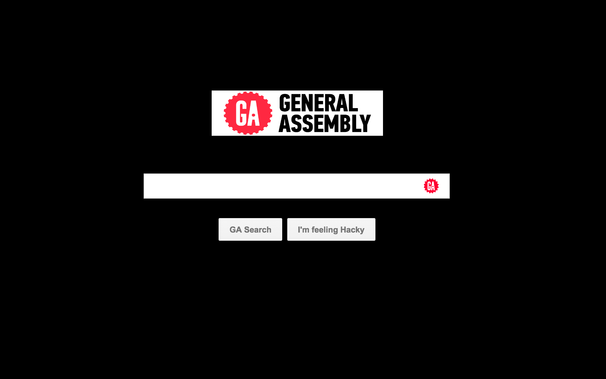
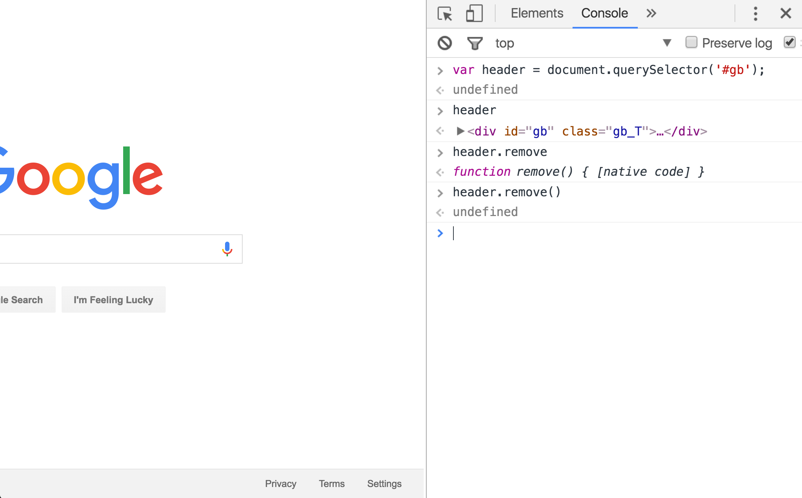

# GA DOM MOD!

You're going to spend the next hour and a half getting really down and dirty with the DOM on a familiar (yet unfamiliar!) website: www.google.com.

It's such a seemingly simple page:


But open up the Chrome Developer Tools, and you'll discover a swamp of esoteric ids and classes, hidden input fields, and divs within divs within divs.

So what is your task? Utilizing your newfound knowledge of the DOM and Vanilla JavaScript, you're going to write a script to turn the Google homepage into a GA modded search page.



You can't just dive into this task without a plan. You'll want spend a couple minutes just exploring the DOM and trying to isolate what areas need to be deleted, and what areas need to be changed or updated.

Programming is about planning. It's not the wild west! Once you've spent some time familiarizing and tinkering (5-10min), you'll want to get started.

I'll start you off in a way that will give you an idea of your process! Comparing the two images, we can see that the GA mod doesn't have the header nav bar or footer. So let's first get rid of those.

Let's remove the header first. This is a three-step job. First, go into the DOM and find the div that contains the top nav bar. Remember to use all your tools. The element selector is your friend!

After some searching, you'll find that the header lives in a div with an id of `#gb` and a class of `.gb_T`. Before moving forward with our script, we should verify that deleting this div will do what we think it will do. Highlight that div in the dom and delete it!

Is it gone? Nice work. Okay, so we know for sure that's the div we want gone. So let's figure out how to do in JavaScript what we just did manually. Refresh the page and use one of the query selector functions to pull the div out of the tree and then delete it.



Nice job. Now we need to build a function to start documenting each of these scripts so we can ultimately write one complete function that will mod our Google homepage in one go!

1. Touch a file called ga_mod.js inside of student_labs
2. Write a function called ga_mod()

```javascript
var ga_mod = function() {

}
```
3. Write your code for deleting the header into this function!

```javascript
var ga_mod = function() {
  var header = document.querySelector('#gb');

  header.remove();
}
```

Nice! Now move on to the footer. The rest of this job is up to you! Good luck.


Images:
- [gear](https://dl.dropboxusercontent.com/s/whkficbkox6t66a/Screen%20Shot%202016-01-24%20at%205.43.31%20PM.png)
- [logo](https://dl.dropboxusercontent.com/s/e2iqc2r53r6omzn/General_Assembly_logo.png)
