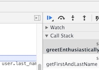

#  Chrome Dev Tools and Debugging JS (90 mins)

<!--
@ID NEEDED: Hey Amy! Found another topic chart for one of Anthony's lessons that would be amazing if you could fill out :) You always have a great way of formatting these.
-->

| Timing | Type | Topic |
| --- | --- | --- |
| 5 min | [Introduction](#opening) | Debugging JavaScript |
| 50 min | [Intro to New Material](#chrome-dev-tools) | Using Chrome Dev Tools to Debug |
| 20 min | [Independent Practice](#debugging-practice) | Debugging Practice |
| 15 min | [Conclusion](#conclusion) |Review and Q&A  |

### LEARNING OBJECTIVES
*After this lesson, you will be able to:*

- Identify and resolve common and uncommon "logical errors" that affect the results of your program.
- Use logs to troubleshoot errors in an application (console log in Dev Tools).
- Conduct real-time debugging in the browser (start small, triangulation, remove code).
- Use debuggers and breakpoints to identify logical errors in expressions.

### STUDENT PRE-WORK
*Before this lesson, you should already be able to:*

- Use Chrome Dev Tools.
- Use a text editor.

<a name="opening"></a>
## Introduction: Debugging JavaScript (5 mins)

At the moment, most of the JavaScript applications we've written have been fairly simple, and most have not been longer than a hundred lines. As applications and websites get more and more complex, we need increasingly powerful tools to help us detect bugs, typos, and implementation errors – and fix them quickly and efficiently.

We've already been using the **Chrome Developer Tools**, but today we'll dive deeper into some of the features we can use to debug JavaScript.

<a name="chrome-dev-tools"></a>
## Using Chrome Dev Tools to debug JavaScript (50 mins)

#### The Sources Panel

Open the starter code in Chrome and make sure the Chrome dev-tools panel is open. Go to the _Sources_ panel.

The _Sources_ panel helps us visualize what's going on when we load JavaScript code. It provides a way for us to debug our code in an interactive way. Follow the steps below to explore the _Sources_ panel:

```
cmd + alt + j
```

- Or right-click anywhere in the page, click "Inspect" and select **Sources**.

Take a look:


Schema from [Chrome Dev Tools Website](https://developer.chrome.com/devtools/docs/javascript-debugging).

#### Debugging with Breakpoints

Modern browsers come with the ability to set a breakpoint on a specific line of your code. This will cause the execution of the program to _pause_ every time the line with the breakpoint is reached, and allow you to inspect the values of variables at that point.

#### Add and Remove Breakpoint

On the left side of the panel, click on a line number where you want to stop the execution of the code. The line number will be highlighted with a blue arrow to show the breakpoint.

**Multiple Breakpoints**

You can add several breakpoints in the scripts; every time a breakpoint is set, the execution will stop. You can enable and disable the breakpoints using the checkboxes on the right sidebar.

It is possible to access a breakpoint by clicking on it in the source on the left.

A breakpoint can be removed by clicking on the blue arrow on the left.

#### Debugger Keyword

Another way of setting breakpoints in the code is to use the `debugger;` keyword. 

`debugger;` stops a script at its line of code and lets you "look around." You can see what variables are available at the line of code where `debugger;` is run.

To make your code continue, press the little eject-looking button.



You can have as many `debugger;` statements as you want. The script will stop at each one and wait for you to tell it to continue.

```js
debugger;

setTimeout(function(){
  alert("Loaded");
}, 0);
```

> ***Note to instructor:*** _Ensure a breakpoint is above the `alert`._

The DevTools console drawer will allow you to experiment within the scope of where the debugger is currently paused. Hit the **Esc** key to bring the console into view. The **Esc** key also closes this drawer.

#### Execution Control

This section of the lesson is taken from [Chrome Dev Tools](https://developer.chrome.com/devtools/docs/javascript-debugging#execution-control).

> **Instructor note:** Ensure that several breakpoints have been created in the JavaScript code before explaining the execution control part of the lesson.

The execution control buttons are located at the top of the side panels and allow you to step through code. The available buttons are:

- **Continue**: Continues code execution until we encounter another breakpoint.
- **Step over**: Steps through code line-by-line to get insights into how each line affects the variables being updated. Should your code call another function, the debugger won't jump into its code, instead stepping over so that the focus remains on the current function.
- **Step into**: Like Step over; however, clicking Step into at the function call will cause the debugger to move its execution to the first line in the functions definition.
- **Step out**: Having stepped into a function, clicking this will cause the remainder of the function definition to run, and the debugger will move its execution to the parent function.
- **Toggle breakpoints**: Toggles breakpoints on/off while leaving their enabled states intact.

There are also several related keyboard shortcuts available in the Sources panel:

| Execution | Shortcut |
|-----------|----------|
| Continue | `F8` or `Command + /` |
| Step over | `F10` or `Command+'` |
| Step into | `F11` or `Command+;`  |
| Step out | `Shift+F11` or `Shift+Command+;` |
| Next call frame | `Ctrl+.` |
| Previous call frame | `Ctrl+,` |

#### Interact with Paused Breakpoints

Once you have one or more breakpoints set, return to the browser window and interact with your page.

#### Pretty Print option

Most of the time, the JavaScript in a website will be minified, meaning that variable names are condensed and spaces and line breaks are removed. This can make the source code unreadable and difficult to debug.

You can re-format the code using the "Pretty Print" button in the bottom-left side of the panel `{}`. This makes the code easier to read and debug.

> When you start building web apps in larger frameworks such as Rails or Express, you'll set up your development environment so that code is only minified when you're deploying a production app, not while you're developing actively.

<a name="debugging-practice"></a>
## Independent Practice (20 mins)

For this exercise, work out of the [starter\_code](starter_code) folder.

Debug the code using the Chrome Developer Tools.

You need to get the functions to log out, one after the other.

<a name="conclusion"></a>
## Conclusion (15 mins)

JavaScript debugging tools have improved significantly over the past few years. It is especially important to understand the link between the JS V8 Engine in Chrome and the way that error reporting is handled, and how you can interact with your scripts to figure out what's going on.

### ADDITIONAL RESOURCES
- Exercises
	- CodeSchool [Discover DevTools Course](https://www.codeschool.com/courses/discover-devtools)
- Videos
	- [Inspect Element](https://generalassembly.wistia.com/medias/3nsqx78lwo)
	- WDI8 Screencasts
		- [Part 1](https://youtu.be/dCukspxmNDs)
		- [Part 2](https://youtu.be/VbfB1qB20Yk)
- Readings
	- [Google Tutorial - Chrome Dev Tools](https://developers.google.com/web/tools/chrome-devtools/)
	- [Scotch - Guide to Chrome Dev Tools](https://scotch.io/tutorials/debugging-javascript-with-chrome-devtools-breakpoints) (Beg - Very Thorough)
	- [Debugging in JS](http://eloquentjavascript.net/08_error.html)
