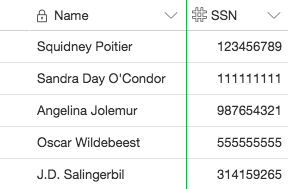

# Table Relationships

In databases, there are a few different ways to describe the relationships between different lists of entities.

## One-to-one (1:1)

The simplest kind of relationship is a one-to-one relationship. Suppose you have a list of people’s names, and a list of social security numbers. Each person has only one social security number, and each social security number is linked to one person. In the context of an database, a one-to-one relationship is usually best represented by consolidating the two tables of information together into a single table, using two fields.

Here are some other examples of one-to-one relationships:

* People-Passports (Each person has only one passport from a particular country and each passport is intended for only one person.)
* Country-Flag (Each country has only one flag and each flag belongs to only one country.)
* Spousal Relationships (Each person has only one spouse.)

## One-to-many (1:M)

A more complex (but also far more common) type of relationship is one-to-many/many-to-one. For example, if you have a list of works of art and a list of museums, each work of art can only be in one museum at a time, but each museum can have many works of art. In a base, splitting these two lists of entities (museums and works of art) into two tables allows you to store information relevant to each entity. For works of art, this could include information like the artist and date of completion, and for museums, this could include information about the museum’s opening hours and its address.

If you were to make tables representing a one-to-many relationship between a list of museums and a list of works of art, you could put each of those lists into a museums table and a works table.

In this relationship:

* A museum has *many* works
* A work belongs to *one* museum

To model this relationship, we just add a `museum_id` column to the `work` table.

## Many-to-many (N:M)

Lastly, entities can also have a many-to-many relationship. Let’s say you have a list of books, and a list of authors—each book may have one or more authors, and each author may have written multiple books. In this case, you have many books related to many authors. Representing the relationship between these two lists of entities requires making a third table.

In this relationship:
* A book can have *many* authors
* An author can have *many* books

Many-to-many relationships require a third table!

table `author-book`

* author_id
* book_id
